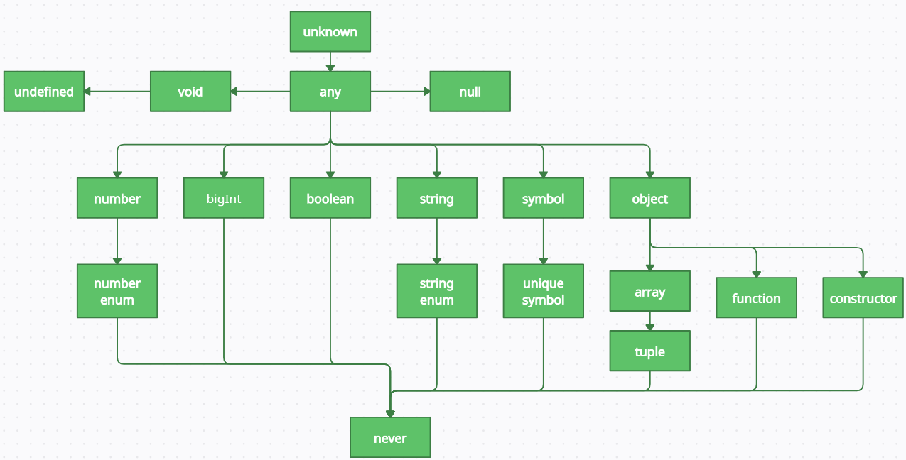

> 자바스크립트 자료형에 없는 타입스크립트만의 타입 시스템을 소개합니다. 그리고 타입의 개념을 응용하여 좀 더 심화한 타입 검사를 수행하는 데 필요한 지식을 살펴보겠습니다.

## 03.1 타입스크립트만의 독자적 타입 시스템

- 타입스크립트는 자바스크립트 자료형에서 제시되지 않은 독자적인 타입시스템을 가지고 있습니다.
  - 엄밀히 이야기하자면 타입스크립트의 타입 시스템이 내포하고 있는 개념은 모두 자바스크립트에서 기인한 것 입니다. 단지 자바스크립트로 표현할 수단과 필요성이 없었을 뿐 입니다.
    - `any` 타입의 경우 자바스크립트의 `typeof`연산자나 `Object.prototype.toString.call(...)`를 사용하여 콘솔에서 변수 타입을 추적해보아도 `any`라는 문자열을 반환하는 경우를 찾을 수 없습니다.
    - 따라서 `any`타입은 타입스크립트에만 존재하는 독자적인 타입 시스템으로 간주할 수 있습니다.
    - 그러나 `any`타입의 개념은 any라는 이름 그대로 어떤 타입이든 매핑할 수 있는 성질을 가지고 있는데, 이는 기존의 자바스크립트의 사용 방식과 일치합니다.
      - 해당 타입 시스템은 타입스크립트에만 존재하는 키워드이지만, 개념 자체는 자바스크립트에서 기인한 타입 시스템이라는 점을 인지할 수 있는 부분입니다.
- **3장에서 등장하는 모든 타입 시스템**은 타입스크립트에만 존재하는 키워드이지만 그 개념은 자바스크립트에서 기인한 타입 스크립트임을 먼저 인지한 다음 각 타입을 살펴보는것이 중요합니다.



### any 타입

- `any`타입은 앞서 말한 대로 자바스크립트에 존재하는 모든 값을 오류 없이 받을 수 있습니다.
  - 즉, 자바스크립트에서 기본적인 사용 방식과 같으므로 타입을 명시하지 않은 것과 동일한 효과를 나타냅니다.
- `any` 타입을 변수에 할당하는 것을 지양해야 하는 패턴이지만, 어쩔 수 없이 사용해야 하는 경우가 존재합니다.

#### any 타입이 사용되어야 하는 경우

##### 1. 개발 단계에서 임시로 값을 지정해야 할 때

- 매우 복잡한 개발 과정에서 type이 확정되지 않았을때 타입을 명시하는데 소요하는 시간을 단축하기 위해.

##### 2. 어떤 값을 받아올지 또는 넘겨줄지 정할 수 없을 때

- 어떤 값의 타입을 명확하게 지정하기 어려운 상황이 발생하였을 때.
  - 예를들어, API 요청 및 응답 처리, 콜백 함수 전달, 타입이 잘 정제되지 않아 파악이 힘든 외부 라이브러리 등을 사용할때 열린 타입으로 대응

##### 3. 값을 예측할 수 없을 대 암묵적으로 사용

- 외부 라이브러리나 웹 API의 요청에 따라 다양한 값을 반환하는 API가 존재하는 경우.

### unknown 타입

- `unknown` 타입은 `any`타입과 유사하게 모든 타입의 값이 할당될 수 있습니다.
- 그러나 `any`를 제외한 다른 타입으로 선언된 변수에는 `unknown` 타입 값을 할당할 수 없습니다.

  ```ts
  let unknownValue: unknown;

  unknownValue = 100; // any 타입과 유사하게 숫자이든
  unknownValue = "hello world"; // 문자열이든
  unknownValue = () => console.log("this is any type"); // 함수이든상관없이할당이가능하지만

  let someValue1: any = unknownValue; // (O) any 타입으로 선언된 변수를 제외한 다른 변수는 모두 할당이 불가
  let someValue2: number = unknownValue; // (X)
  let someValue3: string = unknownValue; // (X)
  ```

- `unknown` 타입은 타입스크립트 3.0이 릴리스 될 때 기존 타입 시스템에서 부족한 부분을 보완하기 위해 등장했습니다.
- `unKnown`에 대응되는 자바스크립트 자료형이 무엇인지 쉽게 떠오르지 않을 만큼 타입스크립트만의 타입 시스템이라고 볼 수 있는데, 왜 `any`타입과 비슷한데 `unknown`이 추가되었을까?

  - `unknown` 타입 변수에 함수를 할당할때에는 컴파일러가 아무런 경고를 주지 않지만 이를 실행하면 다음과 같은 에러가 발생합니다

  ```ts
  // 할당하는 시점에서는 에러가 발생하지 않음
  const unknownFunction: unknown = () => console.log("this is unknown type");

  // 하지만 실행 시에는 에러가 발생; Error: Object is of type 'unknown'.ts (2571)
  unknownFunction();
  ```

  - 함수뿐만 아니라 객체의 속성 접근, 클래스 생성자 호출을 통한 인스턴스 생성 등 객체 내부에 접근하는 모든 시도에서 에러가 발생합니다.
  - 할당 시점에는 아무런 문제가 없는데 왜 호출시 문지가 생기는걸까요? - `unknown`타입은 어떤 타입이 할당되었는지 알 수 없음을 나타내기 때문에 `unknown`타입으로 선언된 변수는 값을 가져오거나 내부 속성에 접근할 수 없습니다. - 이는 `unknown` 타입으로 할당된 변수는 어떤 값이든 올 수 있음을 의미하는 동시에 개발자에게 엄격한 타입 검사를 강제하는 의도를 담고있습니다.

  > #### `any`타입과 `unknown`타입은 사용에서 어떤 차이점이 존재할까요?
  >
  > `any`타입을 사용하면 어떤 값이든 허용됩니다.
  > 앞서 어떤 값이 할당될지 파악하기 어려운 상황에서 `any` 타입을 지정하여 임시로 문제를 회피하는 예시도 살펴보았습니다.
  > 그리고 `any`타입을 사용하면 런타임 시점에 예상치 못한 버그가 발생할 가능성이 높아진다는 것도 설명했습니다.
  >
  > `unknown`타입은 이러한 상황을 보완하기 위해 등장한 타입입니다.
  > `any` 타입과 유사하지만 타입 검사를 강제하고 타입이 식별된 후에 사용할 수 있기 때문에 `any`타입보다 더 안전합니다.
  > 따라서 데이터 구조를 파악하기 힘들 때 `any`타입 대신 `unknown`타입으로 대체해서 사용하는 방법이 권장됩니다.

#### 우아한 형제들에서 들려주는 any와 unknown의 실무 사례를 간단하게 정리해보았어요

##### Q. any를 사용하나요? 사용한다면 어떤 상황에서 사용할까요?

- any는 웬만하면 쓰지 말자고 이야기하고있음.
- 하지만 특정 타입을 어떻게 좁혀서 사용할지 모를 때 어쩔 수 없이 any를 사용한 경험이 있음.
  - 예를들어, 응답 객체의 구조를 정확히 알 수 없는 상황에서 응답 값이 너무 다양해서 타입으로 정의하기 곤란한 상황에서 any를 사용한적이 있음. 하지만 현재에는 any를 사용할 필요가 없는것 같아서 리펙터링에서 전부 수정중.
- 타입스크립트 베이스로 작성된 코드 공간 안에 데이터 플로우가 다 들어있다면 any가 필요한 상황을 떠올리기 힘들지만, 외부에서 어떤 값이 들어올지 모르는 상황이라면 any를 허용할 수 있다고 생각.
  - Axios 라이브러리의 응답 객체 기본값이 any인데 라이브러리에도 들어있는 것을 예시로 본다면 필요한 상황이 있을 것 같다.
  - 하지만 깨진 유리창 이론처럼 any를 한 번 사용하기 시작하면서 남용되는 부분을 주의하고 있음.
- 웬만하면 any사용을 지양하고 있지만 아예 안 쓰기에는 어려운것 같음.
  - 예를 들어, 표 컴포넌트 같이 어떤 값을 받을지 모르는 상황에서 `unknown`을 사용하면 가공할때 타입 캐스팅을 모두 해야하는 상황이 생겨서 any를 사용하고 있음.

##### Q. unknown은 어떨 때 사용할 수 있을까요?

- 강제 타입 캐스팅을 통해 타입을 전환할때 사용.
  ```ts
  const env = process.env as unknown as ProcessEnv;
  ```
- any보다는 조금 더 많이 사용되는것 같다.
  - any는 무엇이든 괜찮다, unknown은 뭔지 모르지만 하나씩 테스트하면서 뭔지 알아내보자 라는 의미라고 생각.
  - 뭔지 모르지만 하나씩 테스트하면서 뭔지 알아내보자 라는 논리 전개가 필요할 때 unknown을 사용.
  - 또 unknown이 훨씬 더 안전한것 같음.
    - any로 선언된 변수에서 length 속성을 참조하면 에러가 나오지 않지만, unknown으로 선언된 것은 에러가 발생하여 더 안전하고 엄격하다고 생각.
- 예상할 수 없는 데이터라면 unknown을 사용.
  - 타입스크립트 4.4부터 try-catch 에러의 타입이 any에서 unknown으로 변경되어서 에러 핸들링할 때도 unknown을 사용.
  - 한면 `as unknown as Type` 같이 강제 타입 캐스팅을 하기도 하는데 이것은 any와 다를 바 없어서 지양해야 함.

##### 확실히 이런 실무 사례들에서 오는 아하모먼트가 많은거같습니다. 서로 비교해서 이야기하는 내용이 이해가 잘 되네요.

### void 타입

- 함수의 매개변수 타입과 반환 타입을 지정해줄때, 아무런 값을 반환하지 않는 경우에는 어떤 타입을 매핑해야 할까?
  - 자바스크립트에서는 함수에서 명시적인 반환문을 작성하지 않으면 기본적으로 `undefined`가 반환됩니다.
  - 하지만 타입스크립트에서는 `void`타입이 사용되는데 `void`는 `undefined`가 아닙니다.
  - 티입스크립트에서 함수가 어떤 값을 반환하지 않는 경우에는 `void`를 지정하여 사용한다고 생각하면 됩니다.
- `void`타입은 주로 함수 반환 타입으로 사용되지만 사실 함수에 국한된 타입은 아닙니다.
- 변수에도 할당 가능하지만 함수가 아닌 값에서는 대부분 무의미합니다.
  - `void`타입으로 지정된 변수는 `undefined`또는 `null`값만 할당할 수 있습니다.
    - 만약 tsconfig에서 `strictNull-Checks`옵션이 설정되었거나 컴파일 시 해당 플래그 설정이 실행되는 겅우에는 `null`값을 할당할 수 없습니다.
    - 또한 명시적인 의미를 부여하는 관점에서 `undefined`와 `null` 타입 키워드를 직접 사용해서 타입을 지정하는 것이 더 바람직합니다.

### never 타입

- `never` 타입도 일반적으로 함수와 관련하여 많이 사용되는 타입입니다.
- `never`라는 단어가 내포하고 있는 의미처럼 `never`타입은 값을 반환할 수 없는 타입을 말합니다.
- `never`타입은 모든 타입의 하위 타입입니다.
  - 즉, `never` 자신을 제외한 어떤 타입도 `never`타입에 할당될 수 없다는 것을 의미합니다.
  - `any`타입이라 할지라도 `never`타입에 할당될 수 없습니다.
- 타입스크립트에서는 조건부 타입을 결정할 때 특정 조건을 만족하지 않는 경우 엄격한 타입 검사 목적으로 `never`타입을 명시적으로 사용하기도 합니다.

#### 값을 반환하지 않는 것과 반환할 수 없는 것을 명확하게 구분해야 합니다.

자바스크립트에서는 값을 반환할 수 없는 예는 크게 2가지로 나눌 수 있습니다.

##### 에러를 던지는 경우

- 자바스크립트에서는 런타임에 의도적으로 에러를 발생시키고 캐치할 수 있습니다.
- throw 키워드를 사용하면 에러를 발생시킬 수 있는데, 이는 값을 반환하는 것으로 간주하지 않습니다. 따라서 특정 함수가 실행중 마지막에 에러를 던지는 작업을 수행한다면 해당 함수의 반환 타입은 `never`입니다.

##### 무한히 함수가 실행되는 경우

- 드물지만 함수 내에서 무한 루프를 실행하는 경우가 있을 수 있습니다.
- 무한 루프는 결국 함수가 종료되지 않음을 의미하기 때문에 값을 반환하지 못합니다.

### Array 타입

- 자바스크립트의 `Object.prototype.toString.call(...)`함수는 객체의 타입을 알아내는데 사용되는 함수입니다.
  - `typeof`를 사용하여 타입을 알 수 도 있지만, 이 함수를 사용하는 이유는 `typeof`의 경우 객체 타입을 단순히 `object` 타입으로 알려주지만, `Object.prototype.toString.call(...)`함수는 객체의 인스턴스까지 알려주기 때문입니다.
- 자바스크립트에서도 확인할 수 있는 자료형인데도 왜 타입스크립트에서 배열을 다루는지 의문이 들 수 있습니다.
  - 타입스크립트에서 다시 Array를 언급하는 이유는 다음과 같이 제시할 수 있습니다.
    - 엄밀히 이야기하면 자바스크립트에서는 배열을 객체에 속하는 타입으로 분류합니다. 즉, 자바스크립트에서는 배열을 단독으로 배열이라는 자료형에 국한하지 않습니다.
    - 타입스크립트에서 Array라는 타입을 사용하기 위해서는 타입스크립트의 특수한 문법을 함께 다루어야 합니다.
- 배열은 Array 키워드 외에도 대괄호 ([])를 사용해서 직접 타입을 명시할 수도 있는데, 이때의 타입은 배열보다 더 좁은 범위힌 튜플 Tuple 을 가리킵니다.

  - 앞서 이야기한 대로, 자바스크립트의 배열은 동적 언어의 특징에 따라 어떤 값이든 배열의 원소로 허용합니다.
    - 즉, 하나의 배열로 선언된 변수에 숫자, 문자열, 객체 등 자료형이 무엇이든 상환없이 원소를 삽입하고 관리할 수 있습니다.
    - 하지만 이런 개념은 타입스크립트의 정적 타이핑과 잘 부합하지 않습니다. 타입스크립트 뿐만 아니라 다른 정적 언어에서도 배열의 원소로 하나의 타입만 사용하도록 명시합니다.
  - 기본적으로 자바스크립트의 동작은 배열 원소의 타입을 구분하지 않기 때문에 다양한 자료형의 원소화 함께 다룰 수 있는데, 만약 여러 타입을 모두 관리해야 하는 배열을 선언하려면 유니온 타입을 사용할 수 있습니다.

  ```ts
  const array1: Array<number | string> = [1, "str"];
  const array2: number[] | string[] = [1, "str"];

  // 후자의 방식은 아래와 같이 선언할 수 도 있습니다.
  const array3: (number | string)[] = [1, "str"];
  ```

- 앞서 언급한대로 타입스크립트에서 배열 타입을 명시하는 것만으로 배열의 길이까지는 제한할 수 없습니다. 그러나 튜플은 배열 타입의 하위 타입으로 기존 타입스크립트의 배열 기능에 길이 제한까지 추가한 타입 시스템이라고 볼 수 있습니다.

  - 튜플은 배열의 특정 인덱스에 정해진 타입을 선언하는 것과 같습니다

  ```ts
  let tuple: [number] = [1];
  tuple = [1, 2]; // 불가능
  tuple = [1, "str"]; // 불가능

  let tuple: [number, string, boolean] = [1, "str", true]; // 여러 타입과 혼합도 가능하다
  ```

  - 기본적으로 타입스크립트에서의 배열과 튜플은 자바스크립트와 달리 제한적으로 사용됩니다.
    - 배열은 사전에 허용하지 않은 타입이 서로 섞이는 것을 방지하여 타입 안정성을 제공합니다.
    - 튜플은 길이까지 제한하여 원소 개수와 타입을 보장합니다.
  - 이처럼 제한하는 이유는 자바스크립트가 갖는 동적 언어의 자유로움으로 인해 발생할 수 있는 런타임 에러와 유지보수의 어려움을 막기 위한 것 입니다.

  ##### 튜플의 대표적인 쓰임새로는 useState가 존재합니다.

  - useState 훅은 두개의 값을 가진 튜플 타입을 반환합니다.
    - 현재 state입니다. 첫 번째 렌더링 중에는 전달한 initialState와 일치합니다.
    - state를 다른 값으로 업데이트하고 리렌더링을 촉발할 수 있는 set 함수입니다.
  - useState는 반환 값이 명확하고 잘 설계된 API이기 때문에 튜플 타입을 통해 이와 같은 유연성을 얻을 수 있습니다.

### enum 타입

- `enum`타입은 열거형이라고도 부르는데 타입스크립트에서 지원하는 특수한 타입입니다.
- `enum`이라는 키워드는 다른 언어에서도 사용하는 개념입니다. 일종의 구조체를 만드는 타입 시스텝 입니다.

  ```ts
  enum ProgrammingLanguage {
    Typescript, // 0
    Javascript, // 1
    Java, // 2
    Python, // 3
    Kotlin, // 4
    Rust, // 5
    Go, // 6
  }

  // 각 멤버에게 접근하는 방식은 자바스크립트에서 객체의 속성에 접근하는 방식과 동일하다
  ProgrammingLanguage.Typescript; // 0
  ProgrammingLanguage.Rust; // 5
  ProgrammingLanguage["Go"]; // 6

  // 또한 역방향으로도 접근이 가능하다
  ProgrammingLanguage[2]; // “Java”
  ```

- 또한 각 멤버에 명시적으로 값을 할당할 수 있습니다.
  - 일부 멤버에 값을 직접 할당하지 않아도 타입스크립트는 누락된 멤버를 이전 멤버 값의 숫자를 기준으로 1씩 늘려가며 자동으로 할당합니다.
  ```ts
  enum ProgrammingLanguage {
    Typescript = "Typescript",
    Javascript = "Javascript",
    Java = 300,
    Python = 400,
    Kotlin, // 401
    Rust, // 402
    Go, // 403
  }
  ```
- `enum`타입은 주로 문자열 상수를 생성하는 데 사용됩니다.

  - 이를 통해 응집력 있는 집합 구조체를 만들 수 있으며, 사용자 입장에서도 간편하게 활용할 수 있습니다.
  - 열거형은 그 자체로 변수타입으로 지정 가능합니다.

    - 이때 열거형을 타입으로 가지는 변수는 해당 열거형이 가지는 모든 멤버를 값으로 받을 수 있습니다.

    ```ts
    enum ItemStatusType {
      DELIVERY_HOLD = "DELIVERY_HOLD", // 배송 보류
      DELIVERY_READY = "DELIVERY_READY", // 배송 준비 중
      DELIVERING = "DELIVERING", // 배송 중
      DELIVERED = "DELIVERED", // 배송 완료
    }

    const checkItemAvailable = (itemStatus: ItemStatusType) => {
      switch (itemStatus) {
        case ItemStatusType.DELIVERY_HOLD:
        case ItemStatusType.DELIVERY_READY:
        case ItemStatusType.DELIVERING:
          return false;
        case ItemStatusType.DELIVERED:
        default:
          return true;
      }
    };
    ```

    - 저는 이런 방식으로 주로 사용하고 있습니다

    ```ts
    // enum을 const object로 변환
    const ItemStatusType = {
      DELIVERY_HOLD: "DELIVERY_HOLD", // 배송 보류
      DELIVERY_READY: "DELIVERY_READY", // 배송 준비 중
      DELIVERING: "DELIVERING", // 배송 중
      DELIVERED: "DELIVERED", // 배송 완료
    } as const;

    // 타입 추출
    type ItemStatusType = (typeof ItemStatusType)[keyof typeof ItemStatusType];

    // 기존 함수는 그대로 유지 (변경 없음)
    const checkItemAvailable = (itemStatus: ItemStatusType) => {
      switch (itemStatus) {
        case ItemStatusType.DELIVERY_HOLD:
        case ItemStatusType.DELIVERY_READY:
        case ItemStatusType.DELIVERING:
          return false;
        case ItemStatusType.DELIVERED:
        default:
          return true;
      }
    };
    ```

    - 열거형을 타입으로 가지는 경우와 문자열로 지정되는 경우를 비교해보겠습니다.
      - 타입안정성: ItemStatusType에 명시되지 않은 다른 문자열은 인자로 받을 수 없습니다. 따라서 타입 안정성이 더 우수합니다.
      - 명확한 의미 전달과 높은 응집력: ItemStatusType 타입이 다루는 값이 무엇인지 명확합니다. 아이템 상태에 대한 값을 모아놓은 것으로 응집력이 뛰어납니다.
      - 가독성: 응집도가 높기 때문에 말하고자 하는 바가 더욱 명확합니다. 따라서 열거형 멤버를 통해 어떤 상태를 나타내는지 쉽게 이해할 수 있습니다.
    - 다만 열거형에 사용에는 주의할 점이 있습니다.
      - 숫자로만 이루어져 있거나 타입스크립트가 자동으로 추론한 열거형은 안전하지 않은 결과를 낳을 수 있습니다.
        - 할당된 값을 넘어서는 범위로 역방향 접근 등등
    - 이러한 동작을 막기 위해 `const enum`으로 열거형을 선언하는 방법이 있습니다.
      - `const enum`은 역방향으로의 접근을 허용하지 않기 때문에 자바스크립트에서의 객체에 접근하는 것과 유사한 동작을 보장합니다.
      - 하지만 `const enum`으로 열거형을 선언하더라도 숫자 상수로 관리되는 열거형은 선언한 값 이외의 값을 할당하거나 접근할 때 이를 방지하지 못합니다.
      - 반면 문자열 상수 방식으로 선언한 열거형은 미리 선언하지 않은 멤버로 접근을 방지합니다.
      - 따라서 문자열 상수 방식으로 열거형을 사용하는 것이 숫자 상수 방식보다 더 안전하며 의도하지 않은 값의 할당이나 접근을 방지하는데 도움이 됩니다.

## 03.2 타입 조합

### 교차 타입 (Intersection)

- 교차 타입을 사용하면 여러 가지 타입을 결합하여 하나의 단일 타입으로 만들 수 있습니다.

### 유니온 타입 (Union)

- 교차 타입이 두가지 타입을 모두 만족하는 경우라면, 유니온 타입은 둘중 하나가 될 수 있는 타입을 말합니다.
- 주로 특정 변수가 가질 수 있는 타입을 전부 나열하는 용도로 사용됩니다.

### 인덱스 시그니처 (Index Signatures)

- 인덱스 시그니처는 특정 타입의 속성 이름은 알 수 없지만 속성값의 타입을 알고 있을 때 사용하는 문법 입니다.
- 인터페이스 내부에 `[key: K]: T`꼴로 타입을 명시해주면 되는데 이는 해당 타입의 속성 키는 모두 `K`타입이어야 하고 속성 값은 모두 `T`타입을 가져야 한다는 의미 입니다.

```ts
interface IndexSignatureEx2 {
  [key: string]: number | boolean;
  length: number;
  isValid: boolean;
  name: string; // 에러 발생
}
```

### 인덱스드 엑세스 타입 (Indexed Access Types)

- 인덱스드 엑세스 타입은 다른 타입의 특정 속성이 가지는 타입을 조회하기 위해 사용됩니다.
- 인덱스에 사용되는 타입 또한 그 자체로 타입이기 때문에 유니온타입, keyof, 타입별칭 등의 표현을 사용할 수 있습니다.
- 아래 첫 번째 예시는 `Example`타입의 `a`속성이 가지는 타입을 조회하기 위한 인덱스드 엑세스 타입입니다.

```ts
type Example = {
  a: number;
  b: string;
  c: boolean;
};

type IndexedAccess = Example["a"];
type IndexedAccess2 = Example["a" | "b"]; // number | string
type IndexedAccess3 = Example[keyof Example]; // number | string | boolean

type ExAlias = "b" | "c";
type IndexedAccess4 = Example[ExAlias]; // string | boolean
```

- 또한 배열의 요소 타입을 조회하기 위해 인덱스드 엑세스 타입을 사용하는 경우가 있습니다.

  - 배열 타입의 모든 요소는 전부 동일한 타입을 가지며 배열의 인덱스는 숫자 타입입니다.
  - 따라서 `number`로 인덱싱하여 배열 요소를 얻은 다음에 `typeof`연산자를 붙여주면 해당 배열 요소의 타입을 가져올 수 있습니다.

  ```ts
  const PromotionList = [
    { type: "product", name: "chicken" },
    { type: "product", name: "pizza" },
    { type: "card", name: "chee-up" },
  ];

  type ElementOf<T> = (typeof T)[number];
  // type PromotionItemType = { type: string; name: string }
  type PromotionItemType = ElementOf<PromotionList>;
  ```

### 맵드 타입 (Mapped Types)

- 보통 `map`이라고 하면 유사한 형태를 가진 여러 항목의 목록 A를 변환된 항목의 목록 B로 바꾸는 것을 의미합니다.
  - 자바스크립트의 `map` 메서드를 생각하면 이해하기 쉬울 것입니다.
- 마찬가지로 맵드 타입은 다른 타입을 기반으로 한 타입을 선언할 때 사용하는 문법인데, 인덱스 시그니처 문법을 사용해서 반복적인 타입 선언을 효과적으로 줄일 수 있습니다.

```ts
type Example = {
  a: number;
  b: string;
  c: boolean;
};

type Subset<T> = {
  [K in keyof T]?: T[K];
};

const aExample: Subset<Example> = { a: 3 };
const bExample: Subset<Example> = { b: "hello" };
const acExample: Subset<Example> = { a: 4, c: true };
```

> TMI 😮
> 저는 맵드 타입 사용을 스키마타입에서 클라이언트에서 사용할 타입으로 변환할때 주로 사용하는거같아요. mongoose의 Type.Object 요소를 string으로 처리할때 사용하고 있습니다.

- 맵드 타입에서 매핑할 때는 `readonly`와 `?`를 수식어로 적용할 수 있습니다.
- 맵드 타입의 특이한 접은 이러한 수식어를 더해주는 것뿐만 아니라 제거할 수도 있다는 것입니다.

  - 기존 타입에 존재하던 `readonly`sk `?`앞에 -를 붙여주면 해당 수식어를 제거한 타입을 선언할 수 있습니다.

  ```ts
  type ReadOnlyEx = {
    readonly a: number;
    readonly b: string;
  };

  type CreateMutable<Type> = {
    -readonly [Property in keyof Type]: Type[Property];
  };

  type ResultType = CreateMutable<ReadOnlyEx>; // { a: number; b: string }

  type OptionalEx = {
    a?: number;
    b?: string;
    c: boolean;
  };

  type Concrete<Type> = {
    [Property in keyof Type]-?: Type[Property];
  };

  type ResultType = Concrete<OptionalEx>; // { a: number; b: string; c: boolean }
  ```

- 배민에서 사용하는 맵드 타입 예시를 살펴보자!

  - BottomSheet 컴포넌트를 사용하기 위해서는 각각 resolver, isOpened 등의 상태를 관리하는 스토어가 필요한데, 해당 스토어의 타입 BottomSheetStore을 선언해주어야 합니다.
  - 이때 BottomSheetMap에 존재하는 모든 Key에 대해 일일히 스토어를 만들어줄 수도 있지만 불필요한 반복이 발생하게 됩니다.
  - 이럴때는 인덱스 시그니처 문법을 사용해서 BottomSheetMap을 기반으로 각 키에 해당하는 스토어를 선언할 수 있습니다.
  - 반복작업을 효율적으로 처리할 수 있게 됩니다.

  ```ts
  const BottomSheetMap = {
    RECENT_CONTACTS: RecentContactsBottomSheet,
    CARD_SELECT: CardSelectBottomSheet,
    SORT_FILTER: SortFilterBottomSheet,
    PRODUCT_SELECT: ProductSelectBottomSheet,
    REPLY_CARD_SELECT: ReplyCardSelectBottomSheet,
    RESEND: ResendBottomSheet,
    STICKER: StickerBottomSheet,
    BASE: null,
  };

  export type BOTTOM_SHEET_ID = keyof typeof BottomSheetMap;

  // 불필요한 반복이 발생한다
  type BottomSheetStore = {
    RECENT_CONTACTS: {
      resolver?: (payload: any) => void;
      args?: any;
      isOpened: boolean;
    };
    CARD_SELECT: {
      resolver?: (payload: any) => void;
      args?: any;
      isOpened: boolean;
    };
    SORT_FILTER: {
      resolver?: (payload: any) => void;
      args?: any;
      isOpened: boolean;
    };
    // ...
  };

  // Mapped Types를 통해 효율적으로 타입을 선언할 수 있다
  type BottomSheetStore = {
    [index in BOTTOM_SHEET_ID]: {
      resolver?: (payload: any) => void;
      args?: any;
      isOpened: boolean;
    };
  };
  ```

- 덧붙여 맵드 타입에서는 as 키워드를 사용하여 키를 재지정할 수 있습니다.
  - 앞선 예시로 보았던 BottomSheetStore의 키 이름에 BottomSheetMap의 키 이름을 그대로 쓰고 싶은 경우가 있을 수 있고, 모든 키에 `_BOTTOM_SHEET`을 붙이는 식으로 공통된 처리를 적용하여 새로운 키를 지정하고 싶을 수도 있습니다.
  - 이럴 때에는 아래 예시처럼 as 키워드를 사용해서 효율적으로 처리할 수 있습니다.
    ```ts
    type BottomSheetStore = {
      [index in BOTTOM_SHEET_ID as `${index}_BOTTOM_SHEET`]: {
        resolver?: (payload: any) => void;
        args?: any;
        isOpened: boolean;
      };
    };
    ```

### 템플릿 리터럴 타입 (Template Literal Types)

- 템플릿 리터럴 타입은 자바스크립트의 템플릿 리터럴 문자열을 사용하여 문자열 리터럴 타입을 선언할 수 있는 문법입니다.
  - 위에서 살펴본 `_BOTTOM_SHEET`을 붙여주는 예시가 바로 템플릿 리터럴 타입을 활용한 것 입니다.

```ts
type Stage =
  | "init"
  | "select-image"
  | "edit-image"
  | "decorate-card"
  | "capture-image";
type StageName = `${Stage}-stage`;
// ‘init-stage’ | ‘select-image-stage’ | ‘edit-image-stage’ | ‘decorate-card-stage’ | ‘capture-image-stage’
```

### 제네릭 (Generic)

- 제네릭은 C나 자바같은 정적 언어에서 다양한 타입 간에 재사용성을 높이기 위해 사용하는 문법입니다.
- 타입스크립트 또한 정적 타입을 가지는 언어이기 때문에 제네릭 문법을 지원하고 있습니다.
  - 제네릭의 사전적 의미를 찾아보면 특징이 없거나 일반적인 것을 뜻합니다.
  - 타입스크립트의 제네릭도 이와 비슷한 맥락을 가지고 있는데 한마디로 일반화된 데이터 타입이라고 할 수 있습니다.
- 타입스크립트의 제네릭의 개념을 풀어보면 함수, 타입, 클래스 등에서 내부적으로 사용할 타입을 미리 정해두지 않고 타입 변수를 사용해서 해당 위치를 비워 둔 다음에, 실제로 그 값을 사용할 때 외부에서 타입 변수 자리에 타입을 지정하여 사용하는 방식을 이야기합니다.
- 보통 타입 변수명으로 `T(Type), E(Element), K(Key), V(Value)`등 한 글자로 된 이름을 많이 사용합니다.
- 제네릭 함수를 호출할때 반드시 타입을 제네릭으로 명시히야 하는 것은 아닙니다. 타입을 명시하는 부분을 생략하면 컴파일러가 인수를 보고 타입을 추론해줍니다.

  ```ts
  function exampleFunc<T>(arg: T): T[] {
    return new Array(3).fill(arg);
  }

  exampleFunc("hello"); // T는 string으로 추론된다
  ```

- 또한 특정 요소 타입을 알 수 없을 때에는 제네릭 타입에 기본값을 구성해줄 수 있습니다.
  ```ts
  interface SubmitEvent<T = HTMLElement> extends SyntheticEvent<T> {
    submitter: T;
  }
  ```
- 제네릭은 일반화된 데이터 타입을 의미합니다. 즉, 제네릭을 사용할 때 어떤 타입이든 될 수 있다는 개념을 알고 있어야 합니다.

  - 예를 들어 배열에만 존재하는 length속성을 제네릭에서 참조하려고 하면 당연하게도 에러가 발생하게 됩니다. 컴파일러는 어떤 타입이 제네릭에 전달될지 알 수 없기 때문에 모든 타입이 length 속성을 사용할 수 없다고 알려주는 것 입니다.
  - 이럴때에는 제네릭 꺽쇠괄호 내부에 제약을 걸어줌으로써 length 속성을 사용할 수 있게 만들어 줄 수 있습니다.

  ```ts
  interface TypeWithLength {
    length: number;
  }

  function exampleFunc2<T extends TypeWithLength>(arg: T): number {
    return arg.length;
  }
  ```

- 제네릭을 사용할 때 주의해야 할 점으로는, 파일 확장자가 tsx일 때 화살표 함수에 제네릭을 사용하면 에러가 발생합니다.
  - tsx는 (타입스크립트 + jsx) 이므로 제네릭의 꺾쇠괄호와 태그의 꺾쇠괄호를 혼동하여 문제가 생기는 것 입니다.
  - 이러한 상황을 피하기 위해서는 제네릭 부분에 `extends`키워드를 사용하여 컴파일러에게 특정 타입의 하위 타입만 올 수 있음을 확실히 알려주면 됩니다.
- 보통 제네릭을 사용할 때는 `function`키워드로 선언하는 경우가 많습니다.

```ts
// 에러 발생: JSX element ‘T’ has no corresponding closing tag
const arrowExampleFunc = <T>(arg: T): T[] => {
  return new Array(3).fill(arg);
};

// 에러 발생 X
const arrowExampleFunc2 = <T extends {}>(arg: T): T[] => {
  return new Array(3).fill(arg);
};
```

## 03.3 제네릭 사용법

### 함수의 제네릭

- 어떤 함수의 매개변수나 반환 값에 다양한 타입을 넣고 싶을 때 제네릭을 사용할 수 있습니다.

```ts
function ReadOnlyRepository<T>(target: ObjectType<T> | EntitySchema<T> | string):
Repository<T> {
  return getConnection(“ro”).getRepository(target);
}
```

### 호출 시그니처의 제네릭

- 호출 시그니처는 타입스크립트의 함수 타입 문법으로 함수의 매개변수와 반환 타입을 미리 선언하는 것을 말합니다.
  - 호출 시그니처를 사용함으로써 개발자는 함수 호출 시 필요한 타입을 별도로 지정할 수 있습니다.
- 호출 시그니처를 사용할 때 제네릭 타입을 어디에 위치시키는지에 따라 타입의 범위와 제네릭 타입을 언제 구체 타입으로 한정할지를 결정할 수 있습니다.

```ts
interface useSelectPaginationProps<T> {
    categoryAtom: RecoilState<number>;
    filterAtom: RecoilState<string[]>; sortAtom:
    RecoilState<SortType>;
    fetcherFunc: (props: CommonListRequest) = > Promise<DefaultResponse<ContentListRes
    ponse<T>>>;
  }
```

- 사실 위 예시는 아직 이해가 잘 안간다. 다른 예시도 살펴보자

```ts
export type UseRequesterHookType = <RequestData = void, ResponseData = void>(
  baseURL?: string | Headers,
  defaultHeader?: Headers
) => [RequestStatus, Requester<RequestData, ResponseData>];
```

- 해당 예시에서 `<RequestData = void, ResponseData = void>`는 호출 시그니처의 괄호 앞에 선언했기 때문에 타입스크립트는 UseRequesterHookType 타입의 함수를 실제 호출할 때 제네릭 타입을 구체 타입으로 한정한다.
- 다른 예시도 살펴보자.

```ts
function useSelectPagination<
  T extends CardListContent | CommonProductResponse
>({
  categoryAtom,
  filterAtom,
  sortAtom,
  fetcherFunc,
}: useSelectPaginationProps<T>): {
  intersectionRef: RefObject<HTMLDivElement>;
  data: T[];
  categoryId: number;
  isLoading: boolean;
  isEmpty: boolean;
} {
  // ...

  return {
    intersectionRef,
    data: swappedData ?? [],
    isLoading,
    categoryId,
    isEmpty,
  };
}
```

### 제네릭 클래스

- 제네릭 클래스는 외부에서 입력된 타입을 클래스 내부에 적용할 수 있는 클래스 입니다.

```ts
class LocalDB<T> {
  // ...
  async put(table: string, row: T): Promise<T> {
    return new Promise<T>((resolved, rejected) = > { /* T 타입의 데이터를 DB에 저장 */ });
  }

  async get(table:string, key: any): Promise<T> {
    return new Promise<T>((resolved, rejected) = > { /* T 타입의 데이터를 DB에서 가져옴 */ });
  }

  async getTable(table: string): Promise<T[]> {
    return new Promise<T[]>((resolved, rejected) = > { /* T[] 타입의 데이터를 DB에서 가져옴*/ });
  }
}

export default class IndexedDB implements ICacheStore {
  private _DB?: LocalDB<{ key: string; value: Promise<Record<string, unknown>>;
  cacheTTL: number }>;

  private DB() {
    if (!this._DB) {
      this._DB = new LocalDB(“localCache”, { ver: 6, tables: [{ name: TABLE_NAME, keyPath: “key” }] });
    }
    return this._DB;
  }
  // ...
}
```

- LocalDB 클래스는 외부에서 `{ key: string; value: Promise<Record<string, unknown>>;
cacheTTL: number }` 타입을 받아들여 클래스 내부에서 사용될 제네릭 타입으로 결정됩니다.
- 제네릭 클래스를 사용하면 클래스 전체에 걸쳐 타입 매개변수가 적용됩니다.
- 특정 메서드만을 대상으로 제네릭을 적용하려면 해당 메서드를 제네릭 메서드로 선언하면 됩니다.

### 제한된 제네릭

- 타입스크립트에서 제한된 제네릭은 타입 매개변수에 대한 제약 조건을 설정하는 기능을 말합니다.
  - 예를 들어 string 타입으로 제약하려면 타입 매개변수는 특정 타입을 상속해야 합니다.
  ```ts
  type ErrorRecord<Key extends string> = Exclude<
    Key,
    ErrorCodeType
  > extends never
    ? Partial<Record<Key, boolean>>
    : never;
  ```
  - 해당 예시처럼 타입 매개변수가 특정 타입으로 bind 되었을 때 키를 바운드 타입 매개변수(bounded type parameters)라고 부릅니다.
  - 그리고 string을 키의 상한 한계(upper bound)라고 합니다.
- 상속받을 수 있는 타입으로는 기본 타입뿐만 아니라 상황에 따라 인터페이스나 클래스도 사용할 수 있습니다. 또한 유니온 타입을 상속해서 선언할 수도 있습니다.

```ts
function useSelectPagination<
  T extends CardListContent | CommonProductResponse
>({
  filterAtom,
  sortAtom,
  fetcherFunc,
}: useSelectPaginationProps<T>): {
  intersectionRef: RefObject<HTMLDivElement>;
  data: T[];
  categoryId: number;
  isLoading: boolean;
  isEmpty: boolean;
} {
  // ...
}

// 사용하는 쪽 코드
const { intersectionRef, data, isLoading, isEmpty } =
  useSelectPagination<CardListContent>({
    categoryAtom: replyCardCategoryIdAtom,
    filterAtom: replyCardFilterAtom,
    sortAtom: replyCardSortAtom,
    fetcherFunc: fetchReplyCardListByThemeGroup,
  });
```

### 확장된 제네릭

- 제네릭 타입은 여러 타입을 상속받을 수 있으며 타입 매개변수를 여러 개 둘 수도 있습니다.

```ts
<Key extends string>
```

- 타입을 이런식으로 제약해버리면 제네릭의 유연성을 잃어버립니다.
- 제네릭의 유연성을 잃지 않으면서 타입을 제약해야 할 때는 타입 매개변수에 유니온 타입을 상속해서 선언하면 됩니다.

```ts
<Key extends string | number>
```

- 유니온 타입으로 T 가 여러 타입을 받게 할 수는 있지만, 타입 매개변수가 여러 개일 때는 처리 할 수 없습니다. 이럴 때에는 매개변수를 하나 더 추가하여 선언합니다.

```ts
export class APIResponse<Ok, Err = string> {
  private readonly data: Ok | Err | null;
  private readonly status: ResponseStatus;
  private readonly statusCode: number | null;

  constructor(
    data: Ok | Err | null,
    statusCode: number | null,
    status: ResponseStatus
  ) {
    this.data = data;
    this.status = status;
    this.statusCode = statusCode;
  }

  public static Success<T, E = string>(data: T): APIResponse<T, E> {
    return new this<T, E>(data, 200, ResponseStatus.SUCCESS);
  }

  public static Error<T, E = unknown>(init: AxiosError): APIResponse<T, E> {
    if (!init.response) {
      return new this<T, E>(null, null, ResponseStatus.CLIENT_ERROR);
    }

    if (!init.response.data?.result) {
      return new this<T, E>(
        null,
        init.response.status,
        ResponseStatus.SERVER_ERROR
      );
    }

    return new this<T, E>(
      init.response.data.result,
      init.response.status,
      ResponseStatus.FAILURE
    );
  }

  // ...
}

// 사용하는 쪽 코드
const fetchShopStatus = async (): Promise<
  APIResponse<IShopResponse | null>
> => {
  // ...

  return (await API.get<IShopResponse | null>("/v1/main/shop", config)).map(
    (it) => it.result
  );
};
```

### 제네릭 예시

- 제네릭의 장점은 다양한 타입을 받게 함으로써 코드를 효율적으로 재사용할 수 있는 것 입니다.

  - 그렇다면 실제 현업에서 가장 많이 제네릭이 활용될 때는 언제일까요? 바로 API 응답 값의 타입을 지정할 때 입니다.

  ```ts
  export interface MobileApiResponse<Data> {
    data: Data;
    statusCode: string;
    statusMessage?: string;
  }
  ```

  - API응답 값에 따라 달라지는 data를 제네릭 타입 Data로 선언하고 있습니다. 이렇게 만든 인터페이스는 실제 API 응답 값의 타입을 지정할 때 아래와 같이 사용되고 있습니다.

  ```ts
  export const fetchPriceInfo = (): Promise<MobileApiResponse<PriceInfo>> => {
    const priceUrl = "https: ~~~"; // url 주소

    return request({
      method: "GET",
      url: priceUrl,
    });
  };

  export const fetchOrderInfo = (): Promise<MobileApiResponse<Order>> => {
    const orderUrl = "https: ~~~"; // url 주소

    return request({
      method: "GET",
      url: orderUrl,
    });
  };
  ```

#### 제네릭을 굳이 사용하지 않아도 되는 타입

- 굳이 필요하지 않은 곳에 제네릭을 사용하면 오히려 코드를 복잡하게 만드는 독이 될 수 있습니다.
- 잘못된 예시들 (굳이 제네릭을 쓴다고?)

  ```ts
  type GType<T> = T;
  type RequirementType = "USE" | "UN_USE" | "NON_SELECT";
  interface Order {
    getRequirement(): GType<RequirementType>;
  }

  // 위 예시의 GType은 다른곳에서는 사용되지 않고, 사용되고 있는 목적의 의미를 정확히 담고 있지도 않고 있다.
  // 굳이 제네릭을 사용하지 않고 타입 매개변수를 그대로 선언하는 것과 같은 기능을 하고있으므로 아래처럼 사용하는 것과 동일하다.
  type RequirementType = "USE" | "UN_USE" | "NON_SELECT";
  interface Order {
    getRequirement(): RequirementType;
  }
  ```

  ##### 제네릭에 any를 사용하는 경우

  ```ts
  type ReturnType<T = any> = {
    // ...
  };
  ```

  - 제네릭은 코드의 재사용성을 높이고 타입 추론을 하는 데 사용된다.
  - 그러나 any를 사용하면 제네릭의 장점과 타입 추론 및 타입 검사를 할 수 있는 이점을 누릴 수 없게 된다.
  - any 타입은 모든 타입을 허용하기 때문에 사실상 자바스크립트와 동일한 방식으로 코드를 작성하는 것과 같다.

  ##### 가독성을 고려하지 않은 사용

  ```ts
  ReturnType<
    Record<
      OrderType,
      Partial<
        Record<
          CommonOrderStatus | CommonReturnStatus,
          Partial<Record<OrderRoleType, string[]>>
        >
      >
    >
  >;

  type CommonStatus = CommonOrderStatus | CommonReturnStatus;

  type PartialOrderRole = Partial<Record<OrderRoleType, string[]>>;

  type RecordCommonOrder = Record<CommonStatus, PartialOrderRole>;

  type RecordOrder = Record<OrderType, Partial<RecordCommonOrder>>;

  ReturnType<RecordOrder>;
  ```

  - 제네릭이 과하게 사용되면 가독성을 해치기 때문에 코드를 일고 타입을 이해하기가 어려워집니다.
  - 제네릭 사용은 의미 단위로 분할해서 사용하는것이 좋습니다.
  - 만약 내가 작성한 코드를 다른 개발자가 쉽게 이해하지 못하고 있다면 혹시 제네릭을 오남용하고 있는 것은 아닌지 검토해봐야 합니다.

참고 레퍼런스

- [useQuery]([https://github.com/TanStack/query/blob/main/packages/react-query/src/useQuery.ts)
