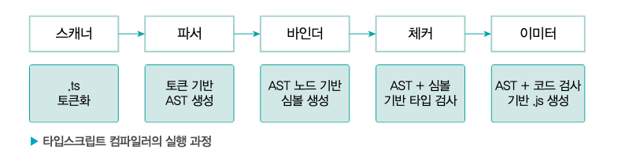

> 타입스크립트 컴파일러의 주요 역할과 구조에 대해 알아보겠습니다. 그리고 실제로 어떻게 컴파일하는지를 확인해 볼 수 있습니다.

## 06.1 자바스크립트의 런타임과 타입스크립트의 컴파일

### 런타임과 컴파일타임

- 자바스크립트는 대표적인 고수준 언어에 속하며 컴파일러나 인터프리터에 의해 저수준 프로그래밍 언어로 번역되어 실행됩니다.
- 컴파일러에 의해 기계어 코드로 변환되어 실행이 가능한 프로그램이 되는데 이 단계를 컴파일타임 이라고 부릅니다.
  - 컴파일타임은 소스코드가 컴파일 과정을 거쳐 컴퓨터가 인식할 수 있는 바이트코드로 변환되어 실행할 수 있는 프로그램이 되는 과정을 의미합니다.
- 소스코드의 컴파일이 완료되면 프로그램이 메모리에 적재되어 실행되는데 이를 런타임 이라고 합니다.
  - 런타임은 컴파일 과정을 마친 응용 프로그램이 사용자에 의해 실행되는 과정입니다.

### 자바스크립트 런타임

- 자바스크립트 런타임은 자바스크립트가 실행되는 환경을 의미합니다.
  - 인터넷 브라우저, node.js 등
- 자바스크립트 런타임은 다양한 구성 요소로 이루어져 있는데, 주요 구성 요소로 자바스크립트 엔진, 웹 API, 콜백큐, 이벤트루프, 렌더큐 가 있습니다.

> 아하모먼트😮
> 자바스크립트는 대표적인 인터프리터 언어로 별도의 컴파일 과정이 존재하지 않는다고 알려져 있습니다. 하지만 엄밀히 말해 자바스크립트에도 컴파일 단계가 존재합니다.
> 자바스크립트를 해석하고 실행하는 역할을 하는 V8 엔진은 때때로 자바스크릡트 코드를 최적화하기 위해 컴파일 단계를 거칩니다.
> 해당 컴파일 과정은 실행 속도를 향상하기 위한 목적으로 자바스크립트 코드를 캐싱하여 이후 실행 시간을 단축합니다.

### 타입스크립트의 컴파일

- 일반적으로 컴파일은 추상화 단계가 다른 고수준 언어에서 저수준 언어로 변환되는 과정을 가리킵니다.
- 타입스크립트는 **tsc**라고 불리는 컴파일러를 통해 자바스크립트 코드로 변환됩니다.
  - 하지만 타입스크립트는 고수준 언어가 저수준 언어로 변환되는 것이 아니라 고수준 언어(TypeScript)가 또 다른 고수준 언어(JavaScript)로 변환되는 것이기 때문에 컴파일이 아닌 트랜스파일 이라고 부르기도 합니다.
  - 또한 이러한 변환 과정은 소스코드를 다른 소스코드로 변환하는 것이기에 타입스크립트 컴파일러를 소스 대 소스 컴파일러 라고 지칭하기도 합니다.

> 아하모먼트😮
> 트랜스파일의 또 다른 예시로 자바스크립트 ES6 이상의 문법을 ES5 이하의 문법으로 변환하는 바벨 등을 들 스 있습니다.
> 그러나 좁은 의미의 컴파일(고수준 => 저수준)과 트랜스파일(고수준 => 고수준)을 통틀어 컴파일이라고 부르기도 합니다.

> 이부분 개념이 많이 헷갈렸는데 정리해주니 좋네요 :)

- 타입스크립트 컴파일러는 소스코드를 해석하여 AST (Abstract Syntax Tree - 추상 구문 트리)를 만들고 이후 타입 확인을 거친 다음에 결과 코드를 생성합니다.
  - 타입스크립트 컴파일러가 소스코드를 컴파일하여 프로그램이 실행되기까지의 과정을 정리해보겠습니다.
    - 타입스크립트 소스코드를 타입스크립트 AST로 만든다. (tsc)
    - 타입 검사기가 AST를 확인하여 타입을 확인한다. (tsc)
    - 타입스크립트 AST를 자바스크립트 소스로 변환한다. (tsc)
    - 자바스크립트 소스코드를 자바스크립트 AST로 만든다 (런타임)
    - AST가 바이트 코드로 변환된다. (런타임)
    - 런타임에서 바이트 코드가 평가되어 프로그램이 실행된다 (런타임)
      > AST (Abstract Syntax Tree)
      > 컴파일러가 소스코드를 해석하는 과정애서 생성되는 데이터 구조입니다. 컴파일러는 어휘적 분석(lexical analysis)과 구문 분석(syntax analysis)을 통해 소스코드를 노드 단위의 트리 구조로 구성합니다.

## 06.2 타입스크립트 컴파일러의 동작

### 코드 검사기로서의 타입스크립트 컴파일러

- null

### 코드 변환기로서의 타입스크립트 컴파일러

- 타입스크립트 컴파일러는 타입을 검사한 다음에 타입스크립트 코드를 각자의 런타임 환경에서 동작할 수 있도록 구버전의 자바스크립트 코드로 트랜스파일 합니다.
- 타입스크립트 소스코드는 브라우저와 같은 런타임에서 실행될 수 없습니다.
- 타입스크립트 컴파일러가 타입스크립트 파일을 자바스크립트로 변환한 결과 예시를 살펴보겠습니다.

  - 타입스크립트 컴파일러의 target 옵션을 사용하여 특정 버전의 자바스크립트 소스코드로 컴파일할 수 있습니다.

  ```ts
  type Fruit = "banana" | "watermelon" | "orange" | "apple" | "kiwi" | "mango";

  const fruitBox: Fruit[] = ["banana", "apple", "mango"];

  const welcome = (name: string) => {
    console.log(`hi! ${name} :)`);
  };

  // ================== 결과물 ====================
  ("use strict");

  var fruitBox = ["banana", "apple", "mango"];

  var welcome = function (name) {
    console.log("hi! ".concat(name, " :)"));
  };
  ```

  - 트랜스파일이 완료된 자바스크립트 파일에서 타입 정보가 제거되었습니다.
    - 타입스크립트가 자바스크립트로 컴파일되어야 브라어저는 코드를 비로소 이해하고 정상적으로 실행할 수 있습니다.
  - 타입스크립트 컴파일러는 타입 검사를 수행한 후 코드 변환을 시작하는데, 이때 타입 오류가 있더라고 일단 컴파일을 진행합니다.
    - 타입스크립트 코드가 자바스크립트 코드로 변환되는 과정은 타입 검사와 독립적으로 동작하기 때문입니다.
    - 때문에 타입스크립트 코드의 타이핑이 잘못되어 발생하는 에러는 자바스크립트 실행 과정에서 런타임 에러로 처리됩니다.

- 타입스크립트 컴파일러의 역할을 크게 2가지로 정리해보겠습니다.
  - 최신 버전의 타입스크립트 - 자바스크립트 코드를 구버전의 자바스크립트로 트랜스파일한다.
  - 코드의 타입 오류를 검사한다.
- 자바스크립트에 익숙한 개발자라면 타입스크립트 컴파일러의 역할이 바벨과 다른게 무엇이냐고 반문할 수도 있습니다.
  > #### 바벨
  >
  > ECMAScript 2015 이후의 코드를 현재 또는 오래된 브라우저와 호환되는 버전으로 변환해주는 자바스크립트 컴파일러 입니다.
  - tsc와 바벨은 소스코드를 ES5 이하의 자바스크립트 코드로 컴파일해준다는 점에서는 동일합니다.
    - 하지만 tsc와 달리 바벨은 타입 검사를 하지 않습니다.
    - 최신 버전의 자바스크립트 코드를 낮은 버전으로 컴파일하는 것이 바벨의 주된 역할입니다.

## 06.3 타입스크립트 컴파일러의 구조

- 컴파일러는 하나의 프로그램으로 이를 구현한 소스 파일이 존재합니다.
  - 타입스크립트 공식 깃허브에서 compiler 라는 별도의 폴더로 구성된 타입스크립트 컴파일러를 찾아볼 수 있습니다.
- tsc는 다섯 단계를 거쳐 타입 검사와 자바스크립트 소스 변환을 진행합니다.
  

1. tsc 명령어를 실행하여 프로그램 객체가 컴파일 과정을 시작합니다.
2. 스캐너는 소스 파일을 토큰 단위로 분리합니다.
3. 파서는 토큰을 이용하여 AST를 생성합니다.
4. 바인더는 AST의 각 노드에 대응하는 심볼을 생성합니다. 심볼은 선언된 타입의 노드 정보를 담고 있습니다.
5. 체커는 AST를 탐색하면서 심볼 정보를 활용하여 타입 검사를 수행합니다.
6. 타입 검사 결과 에러가 없다면 이미터를 사용해서 자바스크립트 소스 파일로 변환합니다.

## 컴파일러 종류가 많은거같아서 정리좀 해봤습니다.

### 1. TypeScript 컴파일러 (tsc)

- 타입 검사: TypeScript의 가장 중요한 역할
- 트랜스파일: TypeScript → JavaScript 변환
- 지원 범위: TypeScript 전용, ESNext → ES5/ES3 변환
- 처리 방식: 전체 프로젝트 단위로 처리 (타입 검사 필요)
- 컴파일 수준: TypeScript (.ts/.tsx) → AST 생성 → 타입 검사 → JavaScript (.js)

#### 장점

- 완전한 타입 검사 및 타입 안전성 보장
- TypeScript 공식 컴파일러로 모든 TS 기능 지원
- .d.ts 파일 생성 가능 (라이브러리 개발에 필수)

#### 단점

- 속도가 상대적으로 느림
- JavaScript만 사용하는 프로젝트에는 오버스펙

#### 사용 사례

- TypeScript 프로젝트의 타입 검사
- 라이브러리 개발 (타입 정의 파일 생성)
- 타입 안전성이 중요한 프로젝트

### 2. Babel

- 트랜스파일: 최신 JavaScript → 구버전 JavaScript
- 폴리필: 최신 기능을 구버전에서 사용 가능하도록 변환
- 플러그인 생태계: 매우 풍부한 플러그인 시스템
- 타입 처리: @babel/preset-typescript를 통해 타입 제거만 수행 (타입 검사 X)
- 컴파일 수준: JavaScript/TypeScript → AST 파싱 → 플러그인 변환 → 구버전 JavaScript

#### 장점

- 극도로 유연한 설정과 커스터마이징
- 방대한 플러그인 생태계
- 브라우저 호환성 관리 탁월
- 복잡한 변환 로직 처리 가능

#### 단점

- 설정이 복잡할 수 있음
- tsc나 SWC에 비해 속도가 느림
- 타입 검사는 별도 도구 필요

#### 사용 사례

- 레거시 브라우저 지원이 필요한 프로젝트
- 복잡한 JavaScript 변환이 필요한 경우
- 기존 Babel 설정이 많은 대형 프로젝트

### 3. SWC (Speedy Web Compiler)

- 고성능 트랜스파일러: Rust 기반으로 매우 빠름
- Babel 호환: Babel 설정과 플러그인 호환
- 번들링: @swc/pack을 통한 번들링 기능
- 타입 제거: TypeScript 타입 제거 (타입 검사 X)
- 컴파일 수준: JavaScript/TypeScript → SWC 파서 → 변환 → 최적화된 JavaScript

#### 성능

- Babel 대비 20배 빠름 (단일 스레드)
- 70배 빠름 (멀티 스레드)

#### 장점

- 뛰어난 성능 (Rust 기반)
- Babel 설정 호환성
- Next.js, Parcel 등 주요 프레임워크에서 채택
- 점진적 마이그레이션 가능

#### 단점

- Babel 대비 플러그인 생태계가 제한적
- 복잡한 변환의 경우 호환성 이슈 가능
- 상대적으로 새로운 도구

#### 사용 사례

- 빌드 성능이 중요한 대형 프로젝트
- Babel에서 마이그레이션하려는 프로젝트
- Next.js, Parcel 사용 프로젝트

### 4. esbuild

- 초고속 번들러: Go 언어 기반
- 트랜스파일러: JavaScript/TypeScript 변환
- 미니파이어: 코드 압축
- 개발 서버: 개발용 서버 제공
- 컴파일 수준: Source Files → esbuild 파서 → 번들링 + 트랜스파일 → 최적화된 번들

#### 성능

- 기존 번들러 대비 10-100배 빠름
- 병렬 처리를 통한 극도의 최적화

#### 장점

- 압도적인 빌드 속도
- 설정이 간단함
- TypeScript, JSX 기본 지원
- Tree-shaking 내장

#### 단점

- 플러그인 생태계 제한적
- 타입 검사 미지원 (타입만 제거)
- 복잡한 코드 스플리팅 제한적
- 앱 개발보다는 라이브러리 번들링에 적합

#### 사용 사례

- 라이브러리 개발 및 번들링
- 빠른 프로토타이핑
- 개발 서버의 의존성 pre-bundling (Vite에서 사용)

### 5. Rolldown

- 차세대 번들러: Rust 기반, Rollup 호환 API
- Vite의 미래: Vite의 esbuild + Rollup을 대체할 예정
- 통합 솔루션: 개발과 프로덕션 번들링을 하나로 통합
- Oxc 기반: 단일 AST 파싱으로 성능 최적화
- 컴파일 수준: Source Files → Oxc 파서 (단일 AST) → Rolldown 변환 → 최적화된 번들

#### 성능

- Rollup 대비 10-30배 빠름
- esbuild와 유사한 성능

#### 장점

- Rollup 플러그인 생태계 호환
- esbuild + Rollup의 장점 결합
- 고급 청킹 제어
- 단일 AST로 파싱 최적화

#### 단점

- 아직 초기 단계 (Beta)
- 일부 기능이 구현 중
- 커뮤니티와 문서가 제한적

#### 사용 사례

- Vite 프로젝트 (향후)
- Rollup에서 성능 개선을 원하는 프로젝트
- 모던 웹 애플리케이션 개발

### 6. React Compiler

- 자동 최적화: React 컴포넌트 자동 메모이제이션
- 빌드타임 도구: 빌드 시점에 최적화 수행
- Rules of React 기반: React 규칙을 이해하여 안전한 최적화
- 성능 향상: useMemo, useCallback, memo 자동 적용
- 컴파일 수준: React 컴포넌트 → React Compiler 분석 → 메모이제이션 추가 → 최적화된 컴포넌트

#### 장점

- 수동 메모이제이션 불필요
- 자동으로 불필요한 리렌더링 방지
- 기존 코드 수정 없이 적용 가능
- Meta에서 프로덕션 사용 중

#### 단점

- React 전용
- Rules of React를 위반하면 최적화 건너뜀
- 아직 RC 단계
- 복잡한 패턴에서 예상과 다를 수 있음

#### 사용 사례

- React 애플리케이션 성능 최적화
- 대규모 React 프로젝트
- 메모이제이션 관리가 복잡한 프로젝트

### 일반적인 조합 패턴

1. TypeScript 기반 프로젝트

- tsc (타입 검사) + Babel/SWC (트랜스파일) + esbuild/Vite (번들링)

2. Next.js 프로젝트

- SWC (트랜스파일) + Webpack (번들링) + React Compiler (최적화)

3. Vite 프로젝트

- esbuild (개발, 의존성 pre-bundling) + Rollup (프로덕션 번들링) + tsc (타입 검사)

4. 라이브러리 개발

- tsc (타입 검사 + .d.ts 생성) + Rollup/esbuild (번들링)

### 선택 기준

#### 성능 우선순위

1. esbuild - 가장 빠른 번들링
2. SWC - 빠른 트랜스파일
3. Rolldown - Rollup 호환 + 빠른 성능
4. Babel - 유연성 vs 성능 트레이드오프

#### 기능 완성도 우선순위

1. tsc - 완전한 TypeScript 지원
2. Babel - 가장 풍부한 변환 기능
3. Webpack - 가장 완성된 번들러
4. SWC - 빠르게 발전 중

#### 생태계 호환성

1. Babel - 가장 많은 플러그인
2. Rollup - 라이브러리 개발 표준
3. Webpack - 기업용 프로젝트 표준
4. esbuild - 심플한 설정
