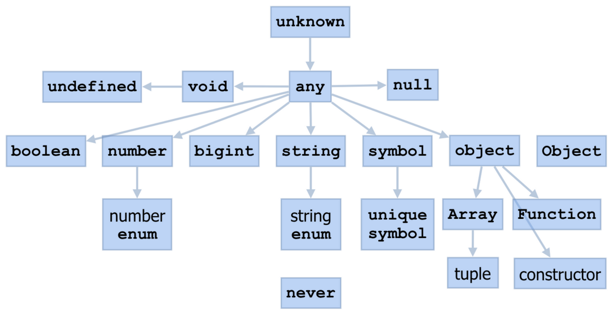

# 1. 타입스크립트만의 독자적 타입 시스템

- 타입스크립트의 타입 시스템은 자바스크립트에서 기인되었지만, 자바스크립트 자료형에서 제시되지 않은 시스템을 가지고 있다.
- 예시) any 타입은 prototype.toString.call(...)를 사용하여 콘솔에서 타입을 추적해도 나오지 않는다.

### 타입스크립트의 타입 계층 구조



## 1) any

### 특징

- 자바스크립트에 존재하는 모든 값을 오류없이 받을 수 있다.
- 자바스크립트의 기본적인 사용 방식과 같다. (타입스크립트를 안쓰는 것과 같은 방식)
- 타입스크립트의 정적 타이핑의 장점은 싹 다 무시하고 동적 타이핑으로 돌아가는 것과 비슷한 결과를 가져온다.
- `any`를 회피하는 것은 정적 타입의 관점에서 봤을 때 아주 타당한 행동이다.
- 회피하기 위해 `tsconfig.json` 파일에서 `noImplicityAny`를 활성화하면 암묵적 any 타입에 대한 경고를 발생시킨다.

### 어쩔 수 없이 any를 써야하는 상황

#### 1. 개발 단계에서 임시로 값을 저장해야 할 때

- 데이터의 세부 스펙이 나오기 전

#### 2. 어떤 값을 받아올지 또는 넘겨줄지 정할 수 없을 때

- API요청 및 응답 처리
- 콜백 함수 전달
- 타입이 잘 정제되지 않아 타입 파악이 힘든 외부 라이브러리 등을 사용할 때

#### 3. 값을 예측할 수 없을 때 암묵적으로 사용

- 외부 라이브러리나 웹 API의 요청에 따라 다양한 값을 반환하는 API가 존재할 수 있다.
- 예시) `Fetch API`

  - Fetch API의 일부 메서드는 요청 이후의 응답을 특정 포맷으로 파싱하는데 이때 반환 타입이 any로 매핑되어 있다.

  ```ts
  async function load() {
    const response = await fetch("https://api.com");
    const data = await response.json(); // response.json()의 리턴 타입은 Promise<any>로 정의되어 있다.

    return data;
  }
  ```

## any를 지양해야 하는 이유

- 타입스크립트의 타입 검사를 무색하게 만들고, 잠재적으로 위험한 상황을 초래할 가능성이 커진다.
- 개발자에게 편의성과 확장성을 제공하기도 하지만 해당 값을 컨트롤하려면 파악해야할 정보도 많다.
  - 도구의 도움을 받을 수 없는 상태에서 온전히 개발자 스스로 책임을 져야 한다.
    -> 협업 시 실수할 가능성이 높아진다. = 휴먼 에러 발생의 위험성이 높아짐

## 2) unknown

> 이름처럼 무엇이 할당될 지 아직 모르는 상태의 타입을 말한다.

### 특징

- `any`와 유사하게 모든 타입의 값이 할당될 수 있다.
- 하지만, any를 제외한 다른 타입으로 선언된 변수에는 unknown 타입 값을 할당할 수 없다.
- 타입스크립트 3.0 릴리스 때 추가됨
  - 기존 타입 시스템에서 부족한 부분을 보완하기 위해 등장했다.
-

| any                                                                                                   | unknown                                                                                                  |
| ----------------------------------------------------------------------------------------------------- | -------------------------------------------------------------------------------------------------------- |
| - 어떤 타입이든 any 타입에 할당 가능 <br /> - any 타입은 어떤 타입으로도 할당 가능 (단, never은 제외) | - 어떤 타입이든 unknown 타입에 할당 가능 <br /> - unknown 타입은 any 타입 외에 다른 타입으로 할당 불가능 |

```ts
let unknownValue: unknown;

unknownValue = 100; // any 타입과 유사하게 숫자이든
unknownValue = "hello world"; // 문자열이든
unknownValue = () => console.log("this is any type"); // 함수이든 상관없이 할당이 가능하지만

let someValue1: any = unknownValue; // (O) any 타입으로 선언된 변수를 제외한 다른 변수는 모두 할당이 불가
let someValue2: number = unknownValue; // (X)
let someValue3: string = unknownValue; // (X)
```

### unknown 타입이 추가된 이유

- any를 타입을 특정 타입으로 수정해야 하는 것을 깜빡하고 누락하면 어떤 값이든 전달될 수 있기 때문에 런타임에 예상치 못한 버그가 발생할 가능성이 높아진다.
- 이러한 any 사용 상황을 보완하기 위해 등장한 unknown 타입은 타입 검사를 강제하고 타입이 식별된 후에 사용할 수 있기 때문에 any 타입보다 더 안전하다.

> 우형 이야기

- any는 웬만하면 지양, 하지만 라이브러리에도 있는 걸 보면 꼭 필요한 경우는 있는 것 같다. <br />
  => 과도한 타입 캐스팅을 해야할 때는 any

  - unknown은 강제 타입 캐스팅으로 타입 전환할 때 사용한다.

  ## 3) void 타입

  > 값을 반환하지 않는 함수의 리턴값을 표현

  - void는 undefined가 아니다.
  - 변수에도 사용할 수는 있지만 void로 타입이 지정된 경우 undefined, null만 할당 가능하다.
  - 하지만, tsconfig.json에서 strictNull-Checks 옵션이 설정되었거나 컴파일 시 해당 플래그 설정이 실행되는 경우에는 null 값을 할당할 수 없다.
  - 명시적으로 undefined와 null 타입 키워드를 직접 사용해서 타입을 지정하는 것이 더 바람직하다.

## 4) never 타입

- 함수와 관련하여 많이 사용되는 타입이다.
- 값을 반환할 수 없는 타입
- never 타입은 모든 타입의 하위 타입이다.
  - never 자신을 제외한 어떤 타입도 never 타입에 할당될 수 없다.
  - 심지어 any 타입도 할당될 수 없다.

### 값을 반환할 수 없는 상황

#### 1. 에러를 던지는 경우

- 런타임에 의도적으로 에러를 발생시키고 캐치할 수 있다.
- throw 키워드를 사용하면 에러를 발생시킬 수 있는데, 이는 값을 반환하는 것으로 간주하지 않는다.

#### 2. 무한히 함수가 실행되는 경우

- 함수 내에서 무한 루프를 실행하는 경우 = 함수가 종료되지 않음을 의미

```ts
function checkStatus(): never {
  while (true) {
    // ...
  }
}
```

## 5) Array 타입

> 배열 타입을 가리키는 Array 키워드는 자바스크립트에서도 Object.prototype.toString.call(...) 연산자를 사용하여 확인할 수 있다.
> typeof 로 확인했을 때는 Object로 나오는 것과 다르게 ,인스턴스까지 알려준다.

- 자바스크립트에서는 배열을 객체에 속하는 타입으로 분류한다. 즉, 자바스크립트에서는 배열을 단독으로 배열이라는 자료형에 국한하지 않는다.
- 타입스크립트에서는 Array라는 타입을 사용하기 위해서는 타입스크립트의 특수한 문법을 함께 다뤄야 한다.

### 자바스크립트의 배열

- 다른 정적 언어에서는 배열의 원소로 하나의 타입만 사용하도록 명시하는 것과 다르게, 자바스크립트는 타입에 상관없이 원소를 삽입하고 관리할 수 있다.
- 자바스크립트에서 배열 타입을 선언하기 위해 제네릭을 이용한다.

```ts
// 숫자에 해당하는 원소만 허용한다.
const array: number[] = [1, 2, 3];
const array2: Array<number> = [1, 2, 3];
```

> 옵셔널 <br/>
> 특정 속성 또는 매개변수가 값이 있을 수도 있고 없을 수도 있는 것을 의미한다.

## 6) enum 타입

> 열거형이라고도 부르는데, 일종의 구조체를 만드는 타입 시스템이다.

- 객체와 비슷하지만, 타입스크립트의 enum은 명명한 각 멤버의 값을 추론한다.
  - 기본적인 추론 방식은 숫자 0부터 1씩 늘려가며 값을 할당하는 것이다.

```ts
enum ProgrammingLanguage {
  TypeScript, // 0
  JavaScript, // 1
  Java, // 2
  Python, // 3
  Kotlin, // 4
}

// 각 멤버에게 접근하는 방식은 자바스크립트에서 객체의 속성에 접근하는 방식과 동일하다
ProgrammingLanguage.TypeScript; //0

// 역방향도 접근이 가능하다. (숫자 타입인 경우에만)
ProgrammingLanguage[2]; // "Java"
```

### enum의 장점

- 타입 안정성 : enum 타입에 명시되지 않은 다른 문자열은 인자로 받을 수 없어 안정성이 우수하다.
- 명확한 의미 전달과 높은 응집력 : enum타입이 다루는 값이 무엇인지 명확하다.
- 가독성 : 응집도가 높기 때문에 말하고자 하는 바가 더욱 명확하다.

### const enum

- 숫자로만 이루어져 있거나, 타입스크립트나 자동으로 추론한 열거형은 안전하지 않은 결과를 낳을 수 있다.
- 할당된 값을 넘어서는 범위로 역방향 접근하더라도 타입스크립트는 막지 않는다.

=> 이러한 문제를 방지하고나 const enum이 등장했다.

- 하지만 숫자 상수로 관리되는 열거형은 이외의 값을 할당하거나 접근할 때 방지할 수 없어 문자열 상수 방식으로 열거형을 사용하는 것이 더 안전하다.

```ts
const enum NUMBER {
  ONE = 1,
  TWO = 2,
}

const muNumber: NUMBER = 100; // NUMBER enum에서 100을 관리하고 있지 않지만 에러를 발생시키지 않는다.

const enum STRING_NUMBER {
  ONE = "ONE",
  TWO = "TWO",
}

const myStringNumber: STRING_NUMBER = "THREE"; // Error
```

- 열거형은 타입스크립트 코드가 자바스크립트로 변환될 때 즉시 실행 함수 형식으로 변환된다.
- 이때 일부 번들러는 트리쉐이킹 과정 중 즉시 실행 함수로 변환된 값을 사용하지 않는 코드로 인식하지 못하는 경우가 발생할 수 있다.

=> 불필요한 코드의 크기가 증가
=> const enum 또는 as const, assertion을 사용한 유니온 타입으로 동일한 효과를 얻을 수 있다.

# 2. 타입 조합

## 1) 교차 타입 (Intersection)

> 여러 가지 타입을 결합하여 하나의 단일 타입을 만들 수 있는 것

- 기존에 존재하는 다른 타입들을 합쳐서 해당 타입의 모든 멤버를 가지는 새로운 타입을 생성하는 것으로 `&`를 사용해서 표기한다.

```ts
type ProductItem = {
  id: number;
  name: string;
  type: string;
  price: number;
  imageUrl: string;
  quantity: number;
};

type ProductItemWithDiscount = ProductItem & { discountAmount: number };
```

## 2) 유니온 타입 (Union)

> 타입 A 또는 B 중 하나가 될 수 있는 타입으로 `A | B` 로 표기한다.

```ts
type CardItem = {
  id: number;
  name: string;
  type: string;
  imageUrl: string;
};

type PromotionEventItem = ProductItem | CardItem;

const printPromotionItem = (item: PromotionEventItem) => {
  console.log(item.name); // 0

  console.log(item.quantity); // 컴파일 에러 발생
};
```

## 3) 인덱스 시그니처 (Index Signatures)

> 특정 타입의 속성 이름은 알 수 없지만, 속성값의 타입을 알고 있을 때 사용하는 문법

- 인터페이스 내부에 `[Key : K] : T` 꼴로 명시해주면 됨
  - 해당 타입의 속성 키는 모두 K타입이어야 하고 속성값은 모두 T타입을 가져야 한다.

```ts
interface IndexSignatureEx {
  [key: string]: number;
}
```

## 4) 인덱스드 엑세스 타입 (Indexed Access Types)

> 다른 타입의 특정 속성이 가지는 타입을 조회하기 위해 사용된다.

```ts
type Example = {
  a: number;
  b: string;
  c: boolean;
};

type IndexedAccess = Example["a"];
type IndexedAccess2 = Example["a" | "b"]; // number | string
type IndexedAccess3 = Example[keyof Example]; // number | string | boolean

type ExAlias = "b" | "c";
type IndexedAccess4 = Example[ExAlias]; // string | boolean
```

- 배열의 요소 타입을 조회하기 위해 인덱스트 엑세스 타입을 사용하는 경우가 있다.
- 배열 타입의 모든 요소는 전부 동일한 타입을 가지며, 배열의 인덱스는 숫자 타입이다. 따라서 number로 인덱싱하여 배열 요소를 얻은 다음에 typeof 연산자를 붙여주면 해당 배열 요소의 타입을 가져올 수 있다.

```ts
const PromotionList = [
  { type: "product", name: "chicken" },
  { type: "product", name: "pizza" },
  { type: "card", name: "cheer-up" },
];

type ElementOf<T> = (typeof T)[number];

// type PromotionItemType = {type : string; name : string}
type PromotionItemType = ElementOf<PromotionList>;
```

## 5) 맵드 타입 (Mapped Types)

> 유사항 형태를 가진 여러 항목의 목록 A를 변환된 항목 목록 B로 바꾸는 것을 의미한다.

```ts
type Example = {
  a: number;
  b: string;
  c: boolean;
};

type Subset<T> = {
  [K in keyof T]?: T[K];
};

const aExample: Subset<Example> = { a: 3 };
const bExample: Subset<Example> = { b: "hello" };
const cExample: Subset<Example> = { c: 4, c: true };
```

- 맵드 타입에서 매핑할 때는 readonly와 ?를 수식어로 적용할 수 있다.
- 반대로, 기존 타입에 존재하던 readonly나 ? 앞에 `-`를 붙여주면 해당 수식어를 제거한 타입을 선언할 수 있다.

```ts
type ReadOnlyEx = {
  readonly a: number;
  readonly b: string;
};

type CreateMutable<Type> = {
  -readonly [Property in keyof Type]: Type[Property];
};

type ResultType = CreateMutable<ReadOnlyEx>; // {a : number; b: string}

type OptionalEx = {
  a?: number;
  b?: string;
  c: boolean;
};

type Concrete<Type> = {
  [Property in keyof Type]-?: Type[Property];
};

type ResultType = Concreate<OptionalEx>; // {a :number; b:string, c:boolean}
```

## 6) 템플릿 리터럴 타입 (Template Literal Types)

> 자바스크립트의 템플릿 리터럴 문자열을 사용하여 문자열 리터럴 타입을 선언할 수 있는 문법이다.

```ts
type Stage =
  | "init"
  | "select-image"
  | "edit-image"
  | "decorate-card"
  | "capture-image";

type StageName = `${Stage}-stage`;
// 'init-stage' | 'select-image-stage' | 'edit-image-stage' | 'decorate-card-stage' | 'capture-image-stage'
```

## 7) 제네릭 (Generic)

> 특징이 없거나 일반적인 것(not specific, general)

- C나 자바 같은 정적 언어에서 다양한 타입 간에 재사용성을 높이기 위해 사용하는 문법이다.
- 타입 변수명으로는 T(Type), E(Element), K(Key), V(Value) 등 한 글자로 된 이름을 많이 사용한다.

```ts
type ExampleArrayType<T> = T[];

const array1: ExampleArrayType<string> = ["치킨", "피자", "우동"];
```

- length 속성을 사용할 수 있는 속성 타입만 받는다는 제약을 걸어줄 수도 있다.

```ts
interface TypeWithLength {
  length: number;
}

function exampleFunc2<T extends TypeWithLength>(arg: T): number {
  return arg.length;
}
```

### 제네릭을 사용할 때 주의할 점

- 파일 확장자가 tsx일 때 화살표 함수에 제네릭을 사용하면 에러가 발생한다.
- tsx는 타입스크립트 +JSX이므로 제네릭의 꺾쇠괄호와 태그의 꺾쇠괄호를 혼동하여 문제가 생기는 것이다.
- 이러한 상황을 피하기 위해서는 제네릭 부분에 extends 키워드를 사용하여 컴파일러에게 특정 타입의 하위 타입만 올 수 있음을 확실하게 알려주면 된다.

```ts
// 에러 발생: JSX element 'T' has no corresponding closing tag
const arrowExampleFunc = <T>(arg: T): T[] => {
  return new Array(3).fill(arg);
};

// 에러 발생 X
const arrowExampleFunc2 => <T extends {}> (arg: T):T[] => {
  return new Array(3).fill(arg);
}
```

## 3. 제네릭 사용법

### 1) 함수의 제네릭

> 어떤 함수의 매개변수나 반환 값에 다양한 타입을 넣고 싶은 경우 제네릭을 사용할 수 있다.

```ts
function readOnlyRepository<T>(
  target: ObjectType<T> | EntitySchema<T> | string
): Repository<T> {
  return getConnection("ro").getRepository(target);
}
```

### 2) 호출 시그니처의 제네릭

> 타입스크립트의 함수 타입 문법으로 함수의 매개변수와 반환 타입을 미리 선언하는 것을 말한다.

- 이를 사용하면 개발자는 함수 호출 시 필요한 타입을 별도로 지정할 수 있게 된다. 호출 시그니처를 사용할 때 제네릭 타입을 어디에 위치시키는지에 따라 타입의 범위와 제네릭 타입을 언제 구체 타입으로 한정할 지를 결정할 수 있다.

```ts
interface useSelectPaginationProps<T> {
  categoryAtom: RecoilState<number>;
  filterAtom: RecoilState<string[]>;
  sortAtom: RecoilState<SortType>;
  fetcherFunc: (
    props: CommonListRequest
  ) => Promise<DefaultResponse<ContentListResponse<T>>>;
}
```

```ts
export type UseRequesterHookType = <RequestData = void, ResponseData = void>(
  baseUrl?: string | Headers,
  defaultHeader?: Headers
) => [RequestStatus, Requester<RequestData, ResponseData>];
```

- 이 예시에서 <RequestData, ResponseData>는 호출 시그니처의 일부, 다시 말해 괄호 앞에 선언했기 때문에 타입스크립트는 UseRequesterHookType 타입의 함수를 실제 호출할 때 제네릭 타입을 구체 타입으로 한정한다.

```ts
function useSelectPagination<
  T extends CardListContent | CommonProductResponse
>({
  categoryAtom,
  filterAtom,
  sortAtom,
  fetcherFunc,
}: useSelectPaginationProps<T>): {
  intersectionRef: RefObject<HTMLDivElement>;
  data: T[];
  categoryId: number;
  isLoading: boolean;
  isEmpty: boolean;
} {
  // ...

  return {
    intersectionRef,
    data: swappendData ?? [],
    isLoading,
    categoryId,
    isEmpty,
  };
}
```

### 3) 제네릭 클래스

> 외부에서 입력된 타입을 클래스 내부에 적용할 수 있는 클래스이다.

```ts
class LocalDB<T> {
  // ...

  async put(table: string, row: T): Promise<T> {
    return new Promise<T>((resolved, rejected) => {
      /* T 타입의 데이터를 DB에 저장 */
    });
  }

  async get(table: string, key: any): Promise<T> {
    return new Promise<T>((resolved, rejected) => {
      /** T타입의 데이터를 DB에서 가져옴 */
    });
  }
}
```

### 4) 제한된 제네릭

> 타입스크립트에서 제한된 제네릭은 타입 매개변수에 대한 제약 조건을 설정하는 기능을 말한다.

- 예를 들어, string 타입으로 제약하려면 타입 매개변수는 특정 타입을 상속(extends) 해야 한다.

```ts
type ErrorRecord<key extends string> = Exclude<Key, ErrorCodeType> extends never
  ? Partial<Record<Key, boolean>>
  : never;
```

- 이처럼 타입 매개변수가 특정 타입으로 묶였을 때 (bind) 키를 바운드 타입 매개변수라고 부른다. 그리고 string을 키의 상한 한계라고 한다.

- 상속받을 수 있는 타입으로는 기본 타입 뿐만 아니라 상황에 따라 interface나 class도 사용할 수 있고, 유니온 타입을 상속해서 선언할 수도 있다.

```ts
  function useSelectPagination<T extends CardListContent | CommonProductResponse>({
    filterAtom, sortAtom, ...//
  })

  // 사용하는 곳
  const {intersectionRef, data, isLoading, isEmpty} = useSelectPagination<CardListContent>({
    categoryAtom ...
  })
```

### 5) 확장된 제네릭

> 제네릭 타입은 여러 타입을 상속 받을 수 있고, 타입 매개변수를 여러 개 둘 수도 있다.

```ts
// 제네릭의 유연성을 잃어버림
<Key extends string>

// 유니온으로 유연성을 잃지 않으면서 제약
<Key extends string | number>
```

- 유니온 타입으로 T가 여러 타입을 받게 할 수는 있지만, 타입 매개변수가 여러 개일 때는 처리할 수 없다.
- 이럴 때는 매개변수를 하나 더 추가하여 선언한다.

### 6) 제네릭 예시

- 제네릭의 장점은 다양한 타입을 받게 함으로써 코드를 효율적으로 재사용할 수 있는 것이다.
- 이러한 제네릭의 장점을 가장 많이 활용할 수 있는 곳은 API 응답 값의 타입을 지정할 때이다.

```ts
export interface MobileApiResponse<Data> {
  data: Data;
  statusCode: string;
  statusMessage?: string;
}

export const fetchPriceInfo = (): Promise<MobileApiResponse<PriceInfo>> => {
  const priceUrl = "https: ~~~"; // url

  return request({
    method: "GET",
    url: priceUrl,
  });
};

export const fetchOrderInfo = (): Promise<MobileApiResponse<Order>> => {
  const orderUrl = "...";

  return request({
    method: "GET",
    url: orderUrl,
  });
};
```

#### 제네릭을 굳이 사용하지 않아도 되는 타입

- 제네릭을 사용하지 않아도 되는 상황에서 사용하면 가독성을 해칠 수 있다.

**1. 굳이**

```
type GType<T> = T;
type RequirementType = "USE" | "UN_USE" | "NON_SELECT";
interface Order {
  getRequirement():GType<RequirementTypes>
}

// 아래처럼 사용하는 것이 좋다.
type RequirementType = "USE" | "UN_USE" | "NON_SELECT";
interface Order {
  getRequirementType ():RequirementType;
}
```

**2. any 사용하기**

- 제네릭은 코드의 재사용성을 높이도 타입 추론을 하는 데 사용된다.
- 그러나 any를 사용하면 제네릭의 장점과 타입 추론 및 타입 검사를 할 수 있는 이점을 누릴 수 없다.
- any 타입은 모든 타입을 허용하기 때문에 사실상 자바스크립트와 동일한 방식으로 코드를 작성하는 것과 같다.

**3. 가독성을 고려하지 않은 사용**

- 제네릭이 과하게 사용되면 가독성을 해치기 때문에 코드를 읽고 타입을 이해하기가 어려워진다.
- 부득이하지 않다면 제네릭은 의미 단위로 분할해서 사용하는 게 좋다.

```ts
ReturnType<
  Record<
    OrderType,
    Partial<
      Record<
        CommonOrderStatus | CommonReturnStatus,
        Partial<Record<OrderRoleType, string[]>>
      >
    >
  >
>;

type CommonStatus = CommonOrderStatus | CommonReturnStatus;
type PartialOrderRole = Partial<Record<OrderRoleType, string>>;
type RecordCommonOrder = Record<CommonStatus, PartialOrderRole>;
type RecordOrder = Record<OrderType, Partial<RecordCommonOrder>>;

ReturnType<RecordOrder>;
```
