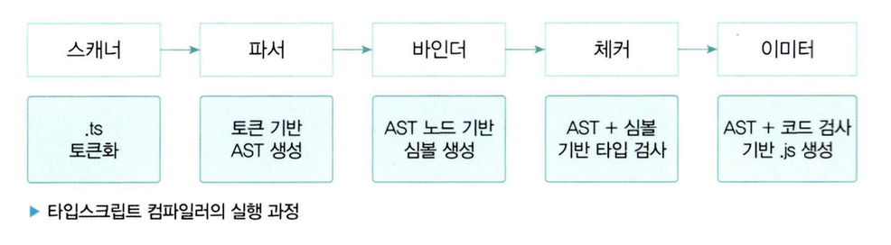
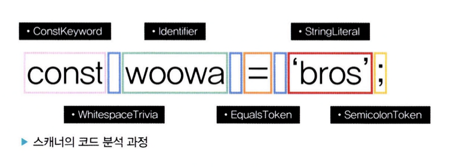
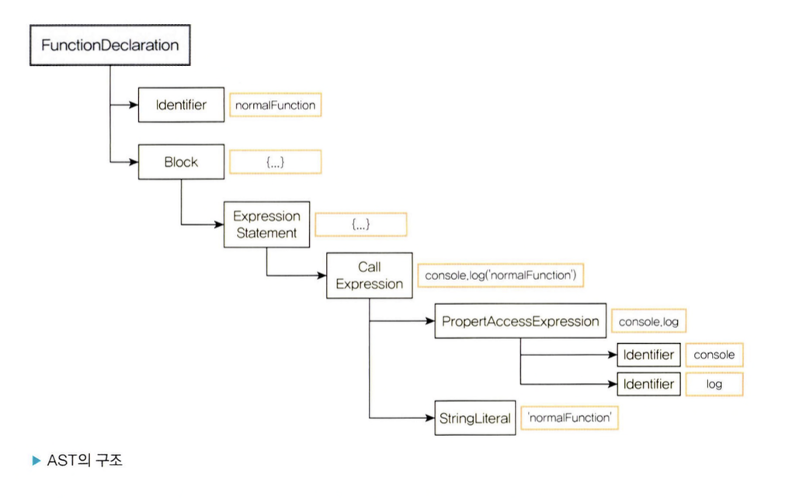

# 자바스크립트의 런타임과 타입스크립트의 컴파일

## 💡타입스크립트의 컴파일 과정

1. tsc 명령어를 사용하여 프로그램 객체가 컴파일 과정을 시작한다.
2. 스캐너는 소스 파일을 토큰 단위로 분리한다.
3. 파서는 토큰을 이용하여 AST를 생성한다.
4. 바인더는 AST의 각 노드에 대응하는 심볼을 생성한다. 심볼은 선언된 타입의 노드 정보를 담고 있다.
5. 체커는 AST를 탐색하면서 심볼 정보를 활용하여 타입 검사를 수행한다.
6. 타입 검사 결과 에러가 없다면 이미터를 사용해서 자바스크립트 소스 파일로 변환한다.

## 1. 런타임과 컴파일 타임

프로그래밍 언어는 고수준과 저수준 언어로 구분할 수 있다.

- 저수준 언어 : 컴퓨터가 이해하기 쉬운 형식
- 고수준 언어 : 인간이 이해하기 쉬운 형식
  - 예시 ) 자바스크립트

> **컴파일타임** <br />
> 소스코드가 컴파일러에 의해 기계어 코드로 변환되어 실행이 가능한 프로그램이 되는 것 <br />
> 즉, 소스코드가 컴파일 과정을 거쳐 컴퓨터가 인식할 수 있는 기계어(바이트 코드)로 변환되어 실행할 수 있는 프로그램이 되는 과정

## 2. 자바스크립트 런타임

- 자바스크립트가 실행되는 환경
- 예시) 크롬이나 사파리 같은 인터넷 브라우저, Node.js
- 런타임 구성 요소
  - 자바스크립트 엔진
  - 웹 API
  - 콜백 큐
  - 이벤트 루프
  - 렌더 큐

#### 💡 자바스크립트의 컴파일

- 자바스크립트는 대표적인 인터프리터(interpreter) 언어로 벼롣의 컴파일 과정이 존재하지 않는다고 알려져 있다.
- 하지만 엄밀히 말해 자바스크립트에도 컴파일 단계가 존재한다.
- 자바스크립트를 해석하고 실행하는 역할을 하는 V8 엔진은 때때로 자바스크립트 코드를 최적화하기 위해 컴파일 단계를 거친다.
- 이 과정은 실행 속도를 향상하기 위한 목적으로 자바스크립트 코드를 캐싱하여 이후 실행 시간을 단축한다.

## 3. 타입스크립트의 컴파일

- 타입스크립트는 tsc라고 불리는 컴파일러를 통해 자바스크립트 코드로 변환된다.
- 타입스크립트는 고수준 언어가 저수준 언어로 변환되는 것이 아니라 고수준 언어(타입스크립트)가 또 다른 고수준 언어(자바스크립트)로 변환되는 것이기 때문에 컴파일이 아닌 **트랜스파일이라고** 부르기도 한다.
- 또 이러한 변환 과정은 소스코드를 다른 소스코드로 변환하는 것이기에 타입스크립트 컴파일러를 **소스 대 소스 컴파일러(source-to-source compiler)** 라고 지칭하기도 한다.

#### 💡 트랜스파일의 또 다른 예시

- C/C++ 코드를 자바스크립트로 변환하는 Emscripten과 자바스크립트 ES6 버전 이상의 문법을 ES5 버전 이하의 문법으로 변환하는 바벨(Babel) 등을 들 수 있다.
- 그러나 좁은 의미의 컴파일(고수준 -> 저수준)과 트랜스파일(고수준 -> 고수준)을 통틀어 컴파일이라고 부르기도 한다.

### 과정

- 타입스크립트는 `.ts` 확장자가 붙은 파일을 찾아내서 컴파일 한 다음에 `.js` 확장자가 붙은 자바스크립트 파일을 만들어낸다.
- 타입스크립트는 소스코드를 해석하여 **AST(Abstract Syntax Tree) - 최소 구문 트리**를 만들고 이후 타입 확인을 거친 다음 결과 코드를 생성한다.

#### 타입스크립트 컴파일러가 소스코드를 컴파일하여 프로그램이 실행되기까지의 과정

1. 타입스크립트 소스코드를 타입스크립트 AST로 만든다 (tsc)
2. 타입검사기가 AST를 확인하여 타입을 확인한다 (tsc)
3. 타입스크립트 AST를 자바스크립트 소스로 변환한다. (tsc)
4. 자바스크립트 소스코드를 자바스크립트 AST로 만든다. (런타임)
5. AST가 바이트 코드로 변환된다. (런타임)
6. 런타임에서 바이트 코드가 평가(evaluate)되어 프로그램이 실행된다. (런타임)

- 타입스크립트의 소스코드의 타입은 1~2단계에서만 사용된다.

  - tsc가 타입스크립트 코드를 자바스크립트의 코드로 컴파일할 때부터는 확인하지 않는다.

- 타입스크립트는 컴파일타임에 타입을 검사하기 때문에 에러가 발생하면 프로그램이 실행되지 않는다.
- 이러한 특징 때문에 타입스크립트를 컴파일타임에 에러를 발견할 수 있는 정적 타입 검사기(static type checker)라고 부른다.

#### 💡 AST (Abstract Syntax Tree)

- 컴파일러가 소스코드를 해석하는 과정에서 생성된 데이터 구조다. 컴파일러는 어휘적 분석(exical analysis)과 구문 분석(syntax analysis)을 통해 소스코드를 노드 단위의 트리 구조로 구성한다.

# 타입스크립트 컴파일러의 동작

## 1. 코드 검사기로서의 타입스크립트 컴파일러

- 타입스크립트 컴파일러는 코드에 타입 오류가 없는지를 확인한다.
- 컴파일 타임에 코드 타입을 확인하기 때문에 런타임 이전에 오류가 있다는 것을 알 수 있다.
- 타입스크립트 컴파일러는 런타임에 발생할 수 있는 문법 오류 등의 에러 뿐만 아니라 타입 에러도 잡아낼 수 있다.
- 타입스크립트 컴파일러는 `tsc binder`를 사용하여 타입 검사를 하고, 타입 검사를 거쳐 코드를 안전하게 만든 이후에는 타입스크립트 AST를 자바스크립트 코드로 변환한다.

## 2. 코드 변환기로서의 타입스크립트 컴파일러

- 타입을 검사한 다음에 타입스크립트 코드를 각자의 런타임 환경에서 동작할 수 있도록 구버전의 자바스크립트로 트랜스파일한다.
- 타입스크립트 소스코드는 브라우저와 같은 런타임에 실행될 수 없다.
  - 타입스크립트 소스코드를 파싱하고 자바스크립트 코드로 변환해야 비로소 실행할 수 있게 된다.
  - 타입스크립트 컴파일러의 target 옵션을 사용하여 특정 버전의 자바스크립트 소스코드로 컴파일할 수 있다.

### 컴파일 예시

```ts
type Fruit = "banana" | "watermelon" | "orange" | "apple" | "kiwi" | "mango";
const fruitBox: Fruit[] = ["banana", "apple", "mango"];

const welcome = (name: string) => {
  console.log(`hi! ${name} :)`);
};
```

```ts
"use strict";
var fruitBox = ["banana", "apple", "mango"];
var welcome = function (name) {
  console.log("hi! ".concat(name, " :)"));
};
```

- 타입스크립트 컴파일러는 타입 검사를 수행한 후 코드 변환을 시작하는데, 이때 타입 오류가 있더라도 일단 컴파일을 진행한다.
  - 이때 타입 오류가 있더라도, 일단 컴파일을 진행한다.
    => 타입스크립트 코드가 자바스크립트 코드로 변환되는 과정은 타입 검사와 독립적으로 동작하기 때문이다.
  - 타입스크립트 코드의 타이핑이 잘못되어 발생하는 에러는 자바스크립트 실행 과정에서 런타임 에러로 처리된다.
- 자바스크립트는 타입 정보를 이해하지 못해서, 소스코드에 타입 에러가 있더라도 자바스크립트로 컴파일되어 타입 정보가 모두 제거된 후에는 타입이 아무런 효력을 발휘하지 못한다.

```ts
interface Square {
  width: number;
}

interface Rectangle extends Square {
  height: number;
}

type Shape = Square | Rectangle;

function calculateArea(shape: Shape) {
  if (shape instanceof Rectangle) {
    // 'Rectangle' only refers to a type, but is being used as a value here
    // Property 'height' does not exist on type 'Shape'
    // Property 'height' does not exist on type 'Square'
    return shape.width * shape.height;
  } else {
    return shape.width * shape.width;
  }
}
```

- instanceof 체크는 런타임에 실행되지만 Rectangle은 타입이기 때문에 자바스크립트 런타임은 해당 코드를 이해하지 못한다.
- 타입스크립트 코드가 자바스크립트로 컴파일 되는 과정에서 모든 인터페이스, 타입, 타입 구문이 제거되어 버리기 때문에 런타임에서는 타입을 사용할 수 없다.

## 컴파일러의 역할

- 최신 버전의 타입스크립트/자바스크립트 코드를 구버전의 자바스크립트로 트랜스파일한다.
- 코드의 타입 오류를 검사한다.

## 바벨의 역할과 다른 점

> **바벨 (Babel)** <br />
> ECMAScript 2015 이후의 코드를 현재 또는 오래된 브라우저와 호환되는 버전으로 변환해주는 자바스크립트 컴파일러이다.

- tsc과 달리 바벨은 타입 검사를 하지않고, 최신 버전의 자바스크립트 코드를 낮은 버전으로 컴파일하는 것이 주된 역할이다.

## 3. 타입스크립트 컴파일러의 구조

- 컴파일러는 하나의 프로그램으로, 이를 구현한 소스 파일이 존재한다.
- 타입스크립트 공식 깃허브에서 compiler라는 별도의 폴더로 구성된 타입스크립트 컴파일러를 찾아볼 수 있다.



### 프로그램 (Program)

- 타입스크립트 컴파일러는 tsc 명령어로 실행된다.
- 컴파일러는 `tsconfig.json`에 명시된 컴파일 옵션을 기반으로 컴파일을 수행한다.
- 먼저 전체적인 컴파일 과정을 관리하는 프로그램 객체(인스턴스)가 생성된다.
- 이 프로그램 객체는 컴파일할 타입스크립트 소스 파일과 소스 파일 내에서 임포트된 파일을 불러오는데, 가장 최초로 불러온 파일을 기준으로 컴파일 과정이 시작된다.

### 스캐너 (Scanner)

- 타입스크립트 소스를 자바스크립트로 변환하기 위한 첫 번째 단계는 스캐너이다.
  : 소스 파일을 어휘적으로 분석하여 토큰을 생성하는 역할을 한다.
  = 소스코드를 작은 단위로 나누어 의미 있는 토큰으로 변환하는 작업 수행

```ts
const woowa = "bros";
```



### 파서 (Parser)

- 스캐너가 소스 파일을 토큰으로 나눠주면 파서는 그 토큰 정보를 이용하여 AST를 생성한다.
- AST는 컴파일러가 동작하는 데 핵심 기반이 되는 자료 구조로, 소스코드의 구조를 트리 형태로 표현한다.
- AST의 최상위 노드는 타입스크립트 소스 파일이며, 최하위 노드는 파일의 끝 지점으로 구성된다.

- 스캐너는 어휘적 분석을 통해 토큰 단위로 소스코드를 나누지만, 파서는 이렇게 생성된 토큰 목록을 활용하여 구문적 분석을 수행한다.
  -> 이를 통해 코드의 실질적인 구조를 노드 단위의 트리 형태로 표현한다.
  - 각각의 노드는 코드상의 위치, 구문 종류, 코드 내용과 같은 정보를 담고 있다.

#### 예시

- ( )에 해당하는 토큰이 있을 때, 파서가 AST를 생성하는 과정에서 이 토큰이 실질적으로 함수의 호출인지, 함수의 인자인지 또는 그룹 연산자인지가 결정된다.

```ts
function normalFunction() {
  console.log("normalFunction");
}

normalFunction();
```

- 위의 코드는 아래와 같은 구조로 AST를 구성한다.



### 바인더 (Binder)

- 바인더의 주요 역할은 체커(Checker) 단계에서 타입 검사를 할 수 있도록 기반을 마련하는 것이다.
- 바인더는 타입 검사를 위해 심볼이라는 데이터 구조를 생성한다.
  - 심볼은 이전 단계의 AST에서 선언된 타입의 노드 정보를 저장한다.

```ts
export interface Symbol {
  flags: SymbolFlags; // Symbol flags
  escapedName: string; // Name of symbol
  declarations?: Declaration[]; // Declarations associated with this symbol
  // 이하 생략
}
```

- flags 필드는 AST에서 선언된 타입의 노드 정보를 저장하는 식별자이다. 심볼을 구분하는 식별자 목록은 다음과 같다.

```ts
// src/compiler/types.ts
export const enum SymbolFlags {
  None = 0,
  FunctionScopedVariable = 1 << 0, // Variable (var) or parameter
  BlockScopedVariable = 1 << 1, // A block-scoped variable (let or const)
  Property = 1 << 2, // Property or enum member
  EnumMember = 1 << 3, // Enum member
  Function = 1 << 4, // Function
  Class = 1 << 5, // Class
  Interface = 1 << 6, // Interface
  ...
}
```

- 심볼 인터페이스의 declarations 필드는 AST 노드의 배열 형태를 보인다. 결과적으로 바인더는 심볼을 생성하고, 해당 심볼과 그에 대응하는 AST 노드를 연결하는 역할을 수행한다.
- 아래는 여러 가지 선언 요소에 대한 각각의 심볼 결과이다.

```ts
type SomeType = string | number;
interface SomeInterface {
  name: string;
  age?: number;
}

let foo: string = "LET";
const obj = {
  name: "이름",
  age: 10,
};

class MyClass {
  name;
  age;

  constructor(name: string, age?: number) {
    this.name = name;
    this.age = age ?? 0;
  }
}

const arrowFunction = () => {};

function normalFunction() {}

arrowFunction();
normalFunction();
const colin = new MyClass("colin");
```

### 체커(Checker)와 이미터(Emitter)

- 체커는 파서가 생성한 AST와 바인더가 생성한 심볼을 활용하여 타입 검사를 수행한다.
- 이 단계에서 체커의 소스 크기는 현재 기준 약 2.7MB 정도로 이전 단계 파서의 소스 크기(500KB)보다 매우 크다.
- 전체 컴파일 과정에서 타입 검사가 차지하는 비중이 크다는 것을 짐작할 수 있다.

#### 체커의 주요 역할

- AST의 노드를 탐색하면서 심볼 정보를 불러와 주어진 소스 파일에 대해 타입 검사를 진행하는 것이다.
- 체커의 타입 검사는 다음 컴파일 단계인 이미터에서 실행된다.
- `checker.ts`의 `getDiagnostics()` 함수를 사용해서 타입을 검증하고, 타입 에러에 대한 정보를 보여줄 에러 메시지를 저장한다.

#### 이미터의 역할

- 타입스크립트 소스 파일을 변환하는 역할을 한다.
- 즉, 타입스크립트 소스를 자바스크립트(js) 파일과 타입 선언 파일(d.ts)로 생성한다.
- 이 변환 과정에서 개발자가 설정한 설정 파일을 읽어오고, 체커를 통해 코드에 대한 타입 검증 정보를 가져온다. 그리고 emitter.ts 소스 파일 내부의 `emitFiles()` 함수를 사용하여 타입스크립트 소스 변환을 진행한다.
