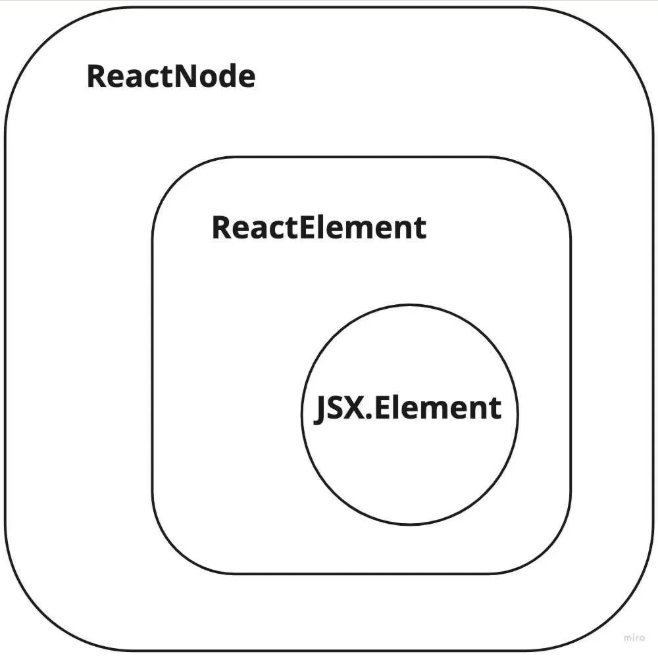

# 리액트 컴포넌트의 타입

## 클래스 컴포넌트 타입

```ts
interface Component<P = {}, S = {}, SS = any>
  extends ComponentLifecycle<P, S, SS> {}

class Component<P, S> {
  /* ... 생략 */
}

class PureComponent<P = {}, S = {}, SS = any> extends Component<P, S, SS> {}
```

- P는 props이고, S는 state이다.
- 상태가 있는 컴포넌트의 경우 제네릭의 두 번째 인자로 타입을 넘겨주면 상태에 대한 타입을 지정할 수 있다.

## 함수 컴포넌트 타입

- 함수 표현식을 사용하여 함수 컴포넌트를 선언할 때 가장 많이 볼 수 있는 형태는 `React.FC` 혹은 `Feact.VFC`로 타입을 지정하는 것이다.
  - FC는 FunctionComponent의 약자로 React.FC와 React.VFC는 리액트에서 함수 컴포넌트의 타입 지정을 위해 제공되는 타입이다.
  - VFC는 children props가 필요하지 않은 컴포넌트에 사용하는 (리액트 18에서는 삭제되고, FC에서 children이 사라짐)

## Children props 타입 지정

```ts
type PropsWithChildren<P> = P & { children?: ReactNode | undefined };
```

- 가장 보편적인 children 타입은 ReactNode | undefined가 된다.
- ReactNode는 ReactElement 외에도 boolean, number 등 여러 타입을 포함하고 있는 타입으로, 더 구체적으로 타이핑하는 용도로 적합하지는 않다.
- 예를 들어 특정 문자열만 허용하고 싶을 때는 children에 대해 추가로 타이핑 해줘야한다.

```ts
type WelcomeProps = {
  children: "천생연분" | "더 귀한 분" | "귀한 분" | "고마운 분";
};
```

## renderer 메서드와 함수 컴포넌트의 반환 타입 - React.ReactElement vs JSX Element vs React.ReactNode

- 함수 컴포넌트의 반환 타입인 `ReactElement`는 아래와 같이 정의된다.

```ts
interface ReactElement<
  P = any,
  T extends string | JSXElementConstructor<any> =
    | string
    | JSXElementConstructor<any>
> {
  type: T;
  props: P;
  key: Key | null;
}
```

React.createElement를 호출하는 형태의 구문으로 변환하면 React.createElement의 반환 타입은 ReactElement이다.

- 리액트는 실제 DOM이 아니라 가상의 DOM을 기반으로 렌더링하는데, 가상 DOM의 엘리먼트는 ReactElement 형태로 저장된다. 즉, ReactElement 타입은 리액트 컴포넌트를 객체 형태로 저장하기 위한 포맷이다.

```ts
declare global {
  namespace JSX {
    interface Element extends React.ReactElement<any, any> {}
  }
}
```

- JSX.Element 타입은 리액트의 ReactElement를 확장하고 있는 타입이며, 글로벌 네임스페이스에 정의되어 있어 외부 라이브러리에서 컴포넌트 타입을재정의할 수 있는 유연성을 제공한다.

```ts
// ReactNode의 타입 정의
type ReactText = string | number;
type ReactChild = ReactElement | ReactText;
type ReactFragment = {} | Iterable<ReactNode>;

type ReactNode =
  | ReactChild
  | ReactFragment
  | ReactPortal
  | boolean
  | null
  | undefined;
```

### ReactNode, ReactElement, JSXElement의 포함 관계



> 사진 좀 훔쳤습니다.

## ReactElement, ReactNode, JSXElement 활용하기

### ReactElement

- JSX가 createElement 메서드를 호출하기 위한 문법이다.

> **JSX** <br />
> JSX는 자바스크립트의 확장 문법으로 리액트에서 UI를 표현하는 데 사용된다. XML과 비슷한 구조로 되어 있으며 리액트 컴포넌트를 선언하고 사용할 때 더욱 간결하고 가독성 있게 코드를 작성할 수 있도록 도와준다. 또한 HTML과 유사한 문법을 제공하여 리액트 사용자에게 렌더링 로직(마크업)을 쉽게 만들 수 있게 해주고, 컴포넌트 구조와 계층 구조를 편리하게 표현할 수 있도록 해준다.

- 즉, JSX는 리액트 엘리먼트를 생성하기 위한 문법이며 트랜스파일러는 JSX 문법을 createElement 메서드 호출문으로 변환하여 아래와 같이 리액트 엘리먼트를 생성한다.

```ts
const element = React.createElement(
  "h1",
  {
    className: "greeting",
  },
  "Hello world"
);

// 구조를 단순하게 보여준다면
const element = {
    type "h1",
    props : {
        className : "greeting",
        children : "Hello world!"
    },
}

declare global {
    namespace JSX {
        interface Element extends React.ReactElement<any, any>{
            // ...
        }
        // ...
    }
}
```

- 리액트는 이런 식으로 만들어진 리액트 엘리먼트 객체를 읽어서 DOM을 구성한다.
- 리액트에는 여러 개의 createElement 오버라이딩 메서드가 존재하는데, 이 메서드들이 반환하는 타입은 ReactElement 타입을 기반으로 한다.

=> ReactElement 타입은 JSX의 createElement 메서드 호출로 생성된 리액트 엘리먼트를 나타내는 타입이라고 볼 수 있다.

### ReactNode

```ts
// ReactChild 타입
type ReactText = string | number;
type ReactChild = ReactElement | ReactText;
```

ReactChild 타입은 ReactElement | string | number로 정의되어 ReactElement 보다는 좀 더 넓은 범위를 갖고 있다.

```ts
// ReactNode 타입
type ReactFragment = {} | Iterable<ReactNode>;
type ReactNode =
  | ReactChild
  | ReactFragment
  | ReactPortal
  | boolean
  | null
  | undefined;
```

=> ReactNode는 리액트의 render 함수가 반환할 수 있는 모든 형태를 담고 있다.

### JSX.Element

```ts
declare global {
  namespace JSX {
    interface Element extends React.ReactElement<any, any> {
      // ...
    }
    // ...
  }
}
```

- ReactElement의 제네릭으로 props와 타입 필드에 대해 any 타입을 가지도록 확장하고 있다. 즉, JSX.Element는 ReactElement의 특정 타입으로 props와 타입 필드를 any로 가지는 타입이라는 것을 알 수 있다.

## 사용 예시

- 이 세 가지 타입을 언제 사용하는 것이 적절할까?

### ReactNode

- JSX 형태의 문법을 때로는 string, number, null, undefined 같이 어떤 타입이든 children prop으로 지정할 수 있게 하고 싶다면, ReactNode 타입으로 children을 선언하면 된다.
- prop으로 리액트 컴포넌트가 다양한 형태를 가질 수 있게 하고 싶을 때 사용

\*\* PropsWithChildren 타입도 ReactNode를 사용하고 이써용

### JSX.Element

- JSX.Element는 앞서 언급한대로 props와 타입 필드가 any 타입인 리액트 엘리먼트를 나타낸다. 이러한 특성 때문에 리액트 엘리먼트를 prop으로 전달받아 render props 패턴으로 컴포넌트를 구현할 때 유용하게 활용할 수 있다.

```tsx
interface Props {
  icon: JSX.Element;
}

const Item = ({ icon }: Props) => {
  // prop으로 받은 컴포넌트의 props에 접근할 수 있다.
  const iconSize = icon.props.size;

  return <li>{icon}</li>;
};

const App = () => {
  return <Item icon={<Icon size={14} />} />;
};
```

- icon prop을 JSX.Element 타입으로 선언함으로써 해당 prop에는 JSX 문법만 삽입할 수 있다. 또한, icon.props에 접근하여 prop으로 넘겨받은 컴포넌트의 상세한 데이터를 가져올 수 있다.

### ReactElement

- JSX.Element 예시를 확장하여 추론 관점에서 더 유용하게 활용할 수 있는 방법은 JSX.Element 대신에 ReactElement 를 사용하는 것이다. 이때 원하는 컴포넌트의 props를 ReactElement의 제네릭으로 지정해줄 수 있다.

만약 JSX.Element가 ReactElement의 props 타입으로 any가 지정되었다면, ReactElement 타입을 활용하여 제네릭에 직접 해당 컴포넌트의 props 타입을 명시해준다.

```tsx
interface IconProps {
  size: number;
}

interface Props {
  // ReactElement의 props 타입으로 IconProps 타입 지정
  icon: React.ReactElement<IconProps>;
}

const Item = ({ icon }: Props) => {
  // icon prop으로 받은 컴포넌트의 props에 접근하면, props의 목록이 추론된다.
  const iconSize = icon.props.size;

  return <li>{icon}</li>;
};
```

## 리액트에서 기본 HTML 요소 타입 활용하기

리액트를 사용하면서 HTML button 태그를 확장한 Button 컴포넌트를 만들어본 경험이 있을 것이다.

```tsx
const SquareButton = () => <button>정사각형 버튼</button>;
```

### DetailedHTMLProps와 ComponentWithoutRef

```ts
type NativeButtonProps = React.DetailedHTMLProps<
  React.ButtonHTMLAttributes<HTMLButtonElement>,
  HTMLButtonElement
>;

type ButtonProps = {
  onClick?: NativeButtonProps["onClick"];
};
```

```ts
type NativeButtonType = React.ComponentPropsWithoutRef<"button">;
type ButtonProps = {
  onClick?: NativeButtonType["onClick"];
};
```

### 언제 무엇을 활용하는 것이 좋을까?

- 이외에도 HTMLProps, ComponentPropsWithRef 등 HTML 태그의 속성을 지원하기 위한 다양한 타입이 있다.

#### 클래스 컴포넌트에서의 ref와 함수형 컴포넌트에서의 ref

- 클래스 컴포넌트는 인스턴스를 반환하기 때문에 ref를 바로 바라보지만, 함수 컴포넌트는 인스턴스를 생성하지 않기 때문에 ref에 기대한 값이 할당되지 않는다. 이런 경우에는 forwardRef를 사용한다.

```tsx
// forwardRef를 사용해 ref를 전달받을 수 있도록 구현
const Button = forwardRef((props, ref) => {
  return (
    <button ref={ref} {...props}>
      버튼
    </button>
  );
});

// buttonRef가 Button 컴포넌트의 button 태그를 바라볼 수 있다
const WrappedButton = () => {
  const buttonRef = useRef();

  return (
    <div>
      <Button ref={buttonRef} />
    </div>
  );
};
```

- forwardRef는 두 개의 인자를 받을 수 있는데, 하나는 ref에 대한 타입 정보이며, 두 번째 인자는 props에 대한 타입 정보이다.
- Button 컴포넌트에 대한 forwardRef 타입 선언은 어떻게 할까?

```tsx
type NativeButtonType = React.ComponentPropsWithoutRef<"button">;

// forwardRef의 제네릭 인자를 통해 ref에 대한 타입으로 HTMLButtonElement를, props에 대한 타입으로 NativeButtonType을 정의했다.
const Button = forwardRef<HTMLButtonElement, NativeButtonType>((props, ref) => {
  return (
    <button ref={ref} {...props}>
      버튼
    </button>
  );
});
```

- 앞의 코드를 보면 Button 컴포넌트의 props에 대한 타입인 NativeButtonType을 정의할 때, `ComponentPropsWithoutRef` 타입을 사용한 것을 알 수 있다. 이렇게 타입을 `React.ComponentPropsWithoutRef<"button">`로 작성하면, button 태그에 대한 HTML 속성을 모두 포함하지만, ref 속성은 제외된다. 이러한 특징 때문에 DetailedHTMLProps, HTMLProps, ComponentPropsWithRef와 같이 ref 속성을 포함하는 타입과는 다르다.

=> 함수 컴포넌트의 props로 `DetailedHTMLProps`와 같이 ref를 포함하는 타입을 사용하게 되면, 실제로는 동작하지 않는 ref를 받도록 타입이 지정되어 예기치 않은 에러가 발생할 수 있다. 따라서 HTML 속성을 확장하는 props를 설계할 때는 `ComponentPropsWithoutRef` 타입을 사용항여 ref 가 실제로 forwardRef와 함께 사용될 때만 props로 전달되도록 타입을 정의하는 것이 안전하다.

# 타입스크립트로 리액트 컴포넌트 만들기

## JSX로 구현된 Select 컴포넌트

- 이 컴포넌트는 각 option의 키-값 쌍을 객체로 받고 있으며, 선택된 값이 변경될 때 호출되는 onChange 이벤트 핸들러를 받도록 구현되어 있으나, 컴포넌트를 사용하는 입장에서 각 속성에 어떤 타입의 값을 전달해야 할 지 알기 어려운 문제를 가지고 있다.

```tsx
const Select = ({ onChange, options, selectedOption }) => {
  const handleChange = (e) => {
    const selected = Object.entries(options).find(
      (_, value) => value === e.target.value
    )?.[0];
    onChange?.(selected);
  };

  return (
    <select
      onChange={handleChange}
      value={selectedOption && options[selectedOption]}
    >
      {Object.entries(options).map(([key, value]) => (
        <option key={key} value={value}>
          {value}
        </option>
      ))}
    </select>
  );
};
```

## JSDocs로 일부 타입 지정하기

## props 인터페이스 적용하기

```tsx
type Option = Record<string, string>;

interface SelectProps {
  options?: Option;
  selectedOption?: string;
  onChange?: (selected?: string) => void;
}

const Select = ({options, selectedOption, onChange}: SelectProps):JSX.Element => // ...
```

## 리액트 이벤트

- 리액트는 가상 DOM을 다루면서 이벤트도 별도로 관리한다. onclick, onchange 같이 DOM 엘리먼트에 등록되어 처리하는 이벤트 리스너와 달리, 리액트 컴포넌트(노드)에 등록되는 이벤트 리스너는 onClick, onChange 처럼 카멜 케이스로 표기한다. 따라서 리액트 이벤트는 브라우저의 고유한 이벤트와 완전히 동일하게 동작하지는 않는다.

- 예를 들어, 리액트 이벤트 핸들러는 이벤트 버블링 단계에서 호출된다. 이벤트 캡처 단계에서 이벤트 핸들러를 등록하기 위해서는 onClickCapture, onChangeCapture와 같이 일반 이벤트 리스너 이름 뒤에 Capture를 붙여야한다.

- 리액트는 브라우저 이벤트를 합성한 합성 이벤트(SyntheticEvent)를 제공한다.

```ts
type EventHandler<Event extends React.SyntheticEvent> = (
  e: Event
) => void | null;
type ChangeEventHandler = EventHandler<ChangeEvent<HTMLSelectElement>>;

const eventHandler1: GlobalEventHandlers["onChange"] = (e) => {
  e.target; // 일반 Event는 target이 없음
};

const eventHandler2: ChangeEventHandler = (e) => {
  e.target; // 리액트 이벤트(합성 이벤트)는 target이 있음
};
```

- 리액트에서 제공하는 기본 컴포넌트도 SelectProps처럼 각각 props에 대한 타입을 명시해두고 있으므로 리액트 컴포넌트에 연결할 이벤트 핸들러도 해당 타입을 일치시켜줘야 한다.

## 훅에 타입 추가하기

```tsx
const fruits = {
  apple: "사과",
  banana: "바나나",
  blueberry: "블루베리",
};

const FruitSelect: VFC = () => {
  const [fruit, changeFruit] = useState<string | undefined>();

  return (
    <Select onChange={changeFruit} options={fruits} selectedOption={fruit} />
  );
};
```

- 만약 타입 매개변수가 없다면 fruit 타입이 undefined로만 추론되면서 onChange의 타입과 일치하지 않아 오류가 발생한다.
- `type Fruit = keyof typeof fruits;`

## 제네릭 컴포넌트 만들기

```tsx
const FruitSelect = () => {
  const [fruit, changeFruit] = useState<Fruit | undefined>();

  return (
    <Select onChange={changeFruit} options={fruits} selectedOption="orange" />
  );
};
```

## HTMLAttributes, ReactProps 적용하기

## styled-components를 활용한 스타일 정의

## 공변성과 반공변성

| 지피티의 도움을 받아서 정리해봤습니다 !

: 어떤 타입 A가 타입 B의 서브타입일 때, 어떤 타입 관계에서 A <-> B의 방향성이 그대로 유지되는지, 거꾸로 되는지

- 공변(covariant): `A ⊆ B → F<A> ⊆ F<B>`
- 반공변(contravariant): `A ⊆ B → F<B> ⊆ F<A>`
- 불변(invariant): 둘 다 아님 (서로 호환되지 않음)

```ts
class Animal {
  speak() {
    console.log("동물");
  }
}

class Dog extends Animal {
  bark() {
    console.log("멍멍");
  }
}
```

- 대표적으로 함수의 반환값(return type)이 공변이다 !

```ts
type AnimalFactory = () => Animal;
type DogFactory = () => Dog;

let f1: AnimalFactory;
let f2: DogFactory;

// DogFactory는 AnimalFactory 자리에 들어갈 수 있다 (공변)
f1 = f2;
```

- 대표적으로 함수의 매개변수(parameter)가 반공변이다 !

```ts
type AnimalHandler = (a: Animal) => void;
type DogHandler = (d: Dog) => void;

let h1: AnimalHandler;
let h2: DogHandler;

// h2 = h1; ✅ 가능
// h1 = h2; ❌ 불가능
```
